# The Visual Guide to Clustering Algorithms

**Understanding K-Means & Hierarchical Clustering Intuitively**

---

## 🎯 The Big Picture: What Is Clustering?

Imagine you walk into a massive party with 200 people you've never met. Your brain automatically starts grouping people:

- "Those folks in the corner are all wearing suits—probably the finance crowd"
- "That group is laughing loudly with craft beers—the creatives?"
- "Those people discussing quietly with name tags—academics?"

**You didn't have labels telling you who belongs where. You found natural groupings based on similarity.**

That's clustering: finding natural groups in data without being told what the groups should be.

---

## 🔵 K-Means Clustering: The "Social Magnet" Algorithm

### The Core Metaphor

Think of K-Means like organizing a networking event with multiple conversation circles. You place K "conversation leaders" (centroids) in the room, and everyone gravitates to the nearest leader. Then leaders move to the center of their groups. Repeat until everyone's settled.

### The K-Means Dance: Four Steps

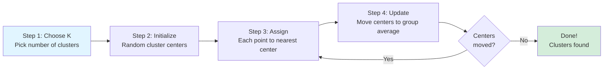

### Visual Walkthrough: K-Means in Action

**Iteration 0: The Setup**

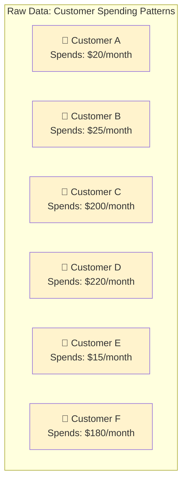

**We decide K=2 (two customer segments)**

**Iteration 1: Random Initialization**

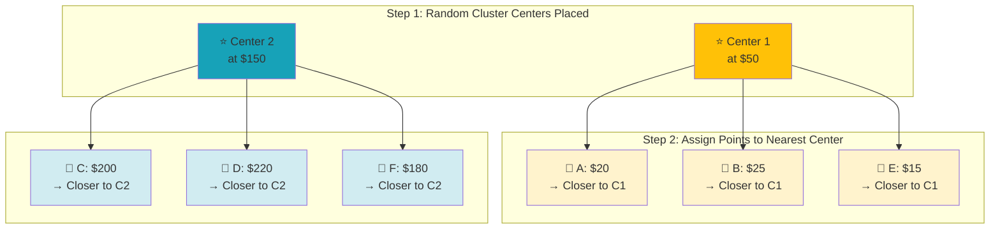

**Iteration 2: Recalculate Centers**

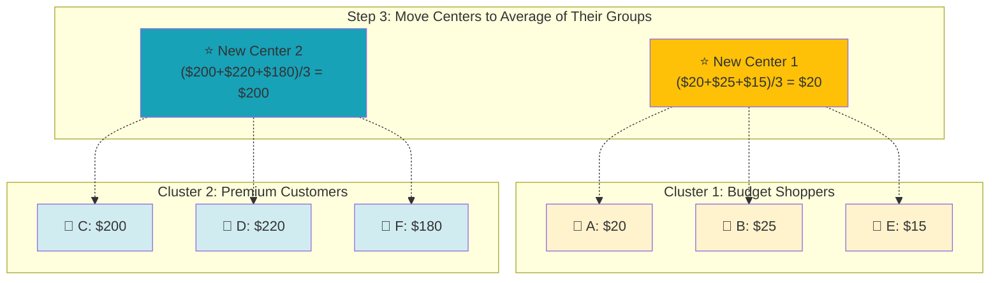

**Convergence: No More Changes**

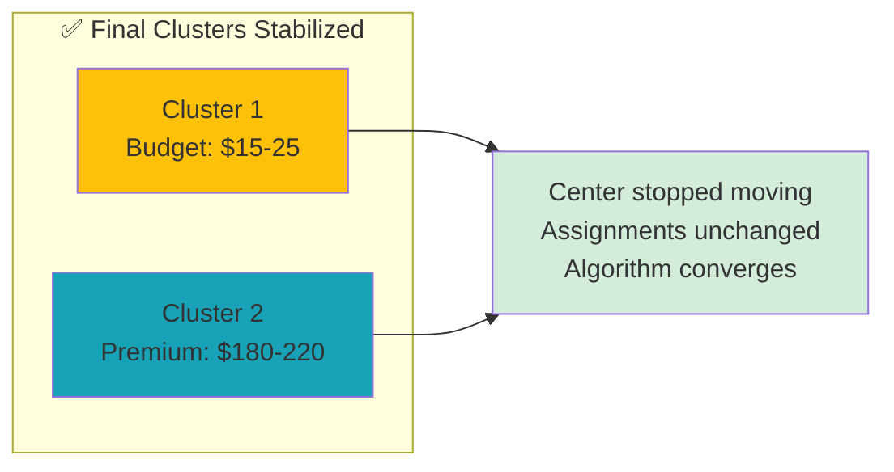

---

### 🧠 The Mathematics Behind the Magic

**Distance Metric: Euclidean Distance**

For each point, calculate distance to each center:

```
Distance = √[(x₁ - x₂)² + (y₁ - y₂)²]
```

**Assignment Rule:** Assign each point to the cluster with the **minimum distance**.

**Update Rule:** New centroid = **mean** of all points assigned to that cluster

```
New Center = (Σ all points in cluster) / (number of points)
```

**Stopping Criteria:**

- Centers don't move (or move less than threshold ε)
- OR maximum iterations reached

---

### 💡 K-Means Key Insights

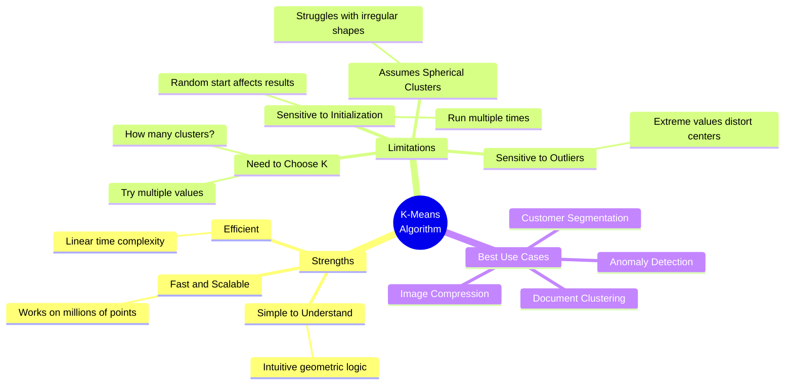

---

### 🎯 The K Selection Problem: The "Elbow Method"

**How do you choose K?**

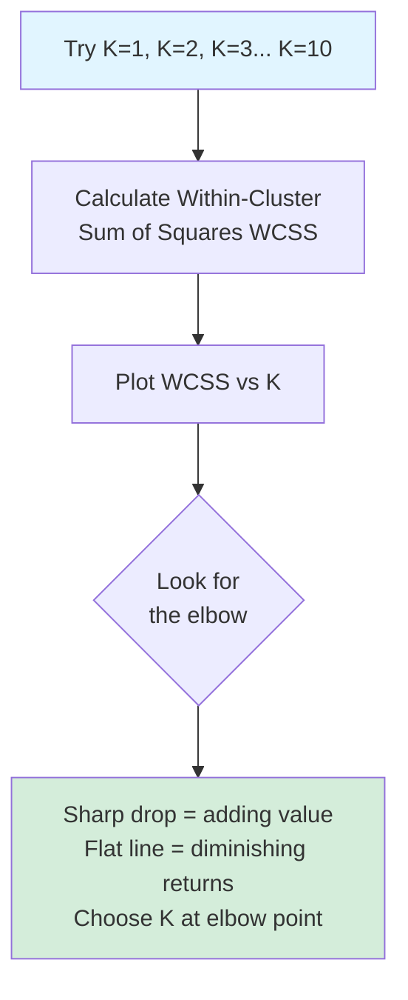

**Visual Example of Elbow:**

```
WCSS
  │
  │  *
  │    *
  │      *  ← Elbow here! (K=3)
  │        * * * * *
  │________________
    1  2  3  4  5  6
          K (clusters)
```

At K=3, we get significant improvement. Beyond K=3, improvement is marginal. **Choose K=3.**

---

## 🌳 Hierarchical Clustering: The "Family Tree" Algorithm

### The Core Metaphor

Imagine organizing a family reunion photo. You could:

1. Start with everyone as individuals
2. Group siblings together
3. Group families together
4. Group extended families
5. Eventually, everyone's in one big group

**That's hierarchical clustering: building a tree of relationships from bottom-up.**

---

### Two Approaches to Hierarchy

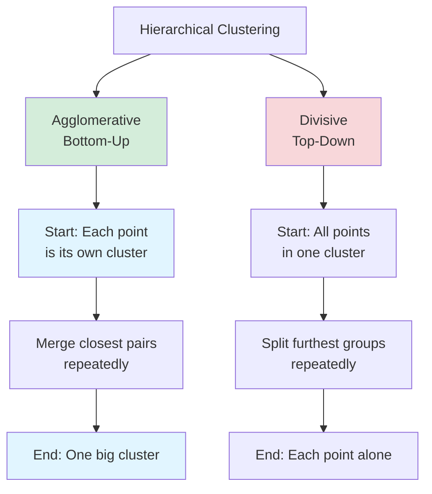

**We'll focus on Agglomerative (more common).**

---

### Agglomerative Hierarchical Clustering: The Step-by-Step Dance

**The Algorithm:**

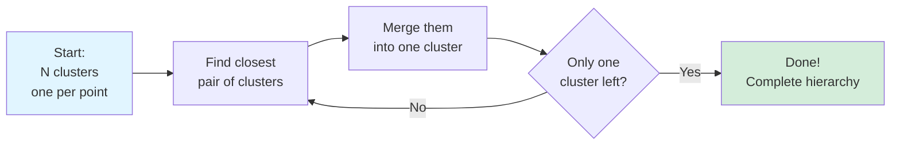

---

### Visual Walkthrough: Building the Tree

**Example: Clustering 6 Companies by Revenue**

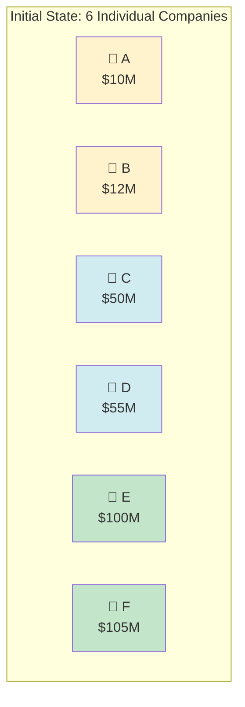

**Step 1: Find Closest Pair**

Distance matrix (in $M):

```
    A    B    C    D    E    F
A   0    2   40   45   90   95
B   2    0   38   43   88   93
C  40   38    0    5   50   55
D  45   43    5    0   45   50
E  90   88   50   45    0    5
F  95   93   55   50    5    0
```

**Closest pair: A & B (distance = 2)**

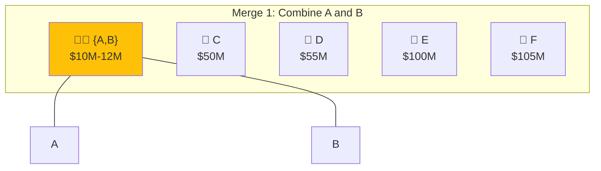

**Step 2: Find Next Closest**

New distance matrix (using average linkage):

```
    {A,B}  C    D    E    F
{A,B}  0   39   44   89   94
C     39    0    5   50   55
D     44    5    0   45   50
E     89   50   45    0    5
F     94   55   50    5    0
```

**Closest pair: E & F (distance = 5)**

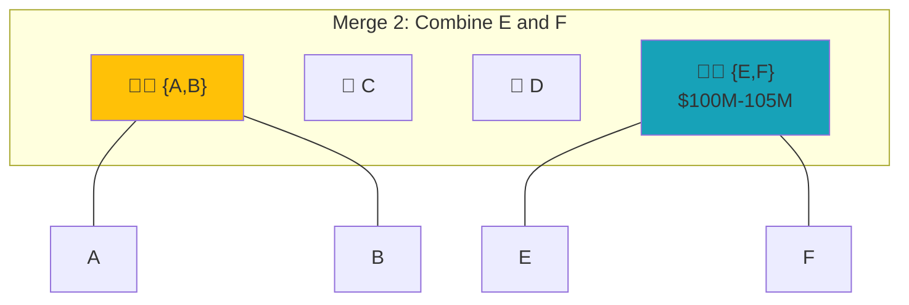

**Step 3: Continue Until Complete**

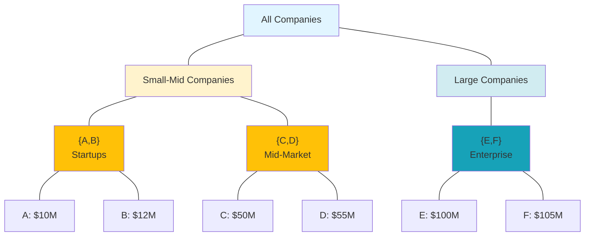

---

### 📊 The Dendrogram: Your Clustering Roadmap

**A dendrogram is the visual output of hierarchical clustering.**

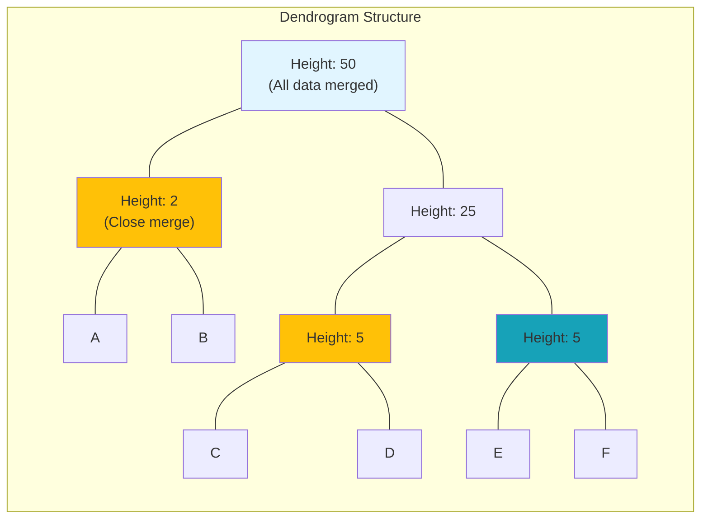

**Reading the Dendrogram:**

1. **Y-axis (Height):** Distance at which clusters merge
    
    - Low height = very similar items merged early
    - High height = dissimilar groups merged late
2. **Horizontal cuts:** Choose number of clusters
    
    - Cut at height 10 → 3 clusters: {A,B}, {C,D}, {E,F}
    - Cut at height 30 → 2 clusters: {A,B,C,D}, {E,F}
    - Cut at height 60 → 1 cluster: {A,B,C,D,E,F}
3. **Leaf nodes:** Original data points
    

---

### 🔗 Linkage Methods: How to Measure "Closeness"

When clusters have multiple points, how do we measure distance between clusters?

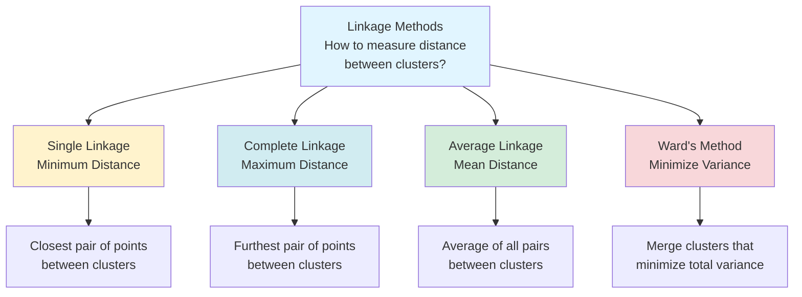

**Visual Comparison:**

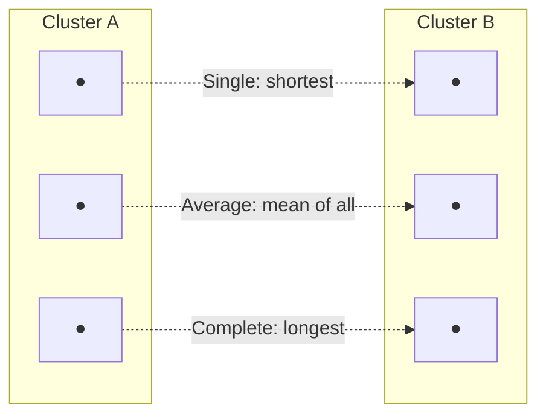

**When to use each:**

- **Single Linkage:** Finds elongated, chain-like clusters (sensitive to outliers)
- **Complete Linkage:** Finds compact, spherical clusters
- **Average Linkage:** Balanced approach (most common)
- **Ward's Method:** Minimizes within-cluster variance (most commonly used)

---

### 🧠 Mathematical Foundation

**Distance Between Clusters:**

**Single Linkage:**

```
d(A,B) = min{distance(a,b) : a ∈ A, b ∈ B}
```

**Complete Linkage:**

```
d(A,B) = max{distance(a,b) : a ∈ A, b ∈ B}
```

**Average Linkage:**

```
d(A,B) = (1/|A||B|) Σ distance(a,b) for all a ∈ A, b ∈ B
```

**Ward's Method:**

```
Minimize: Σ Σ (x - μᵢ)² 
where μᵢ is the mean of cluster i
```

---

### 💡 Hierarchical Clustering Key Insights

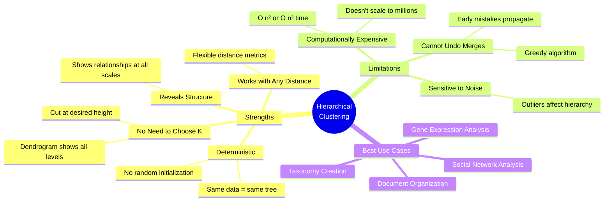

---

## ⚖️ K-Means vs Hierarchical: The Decision Matrix

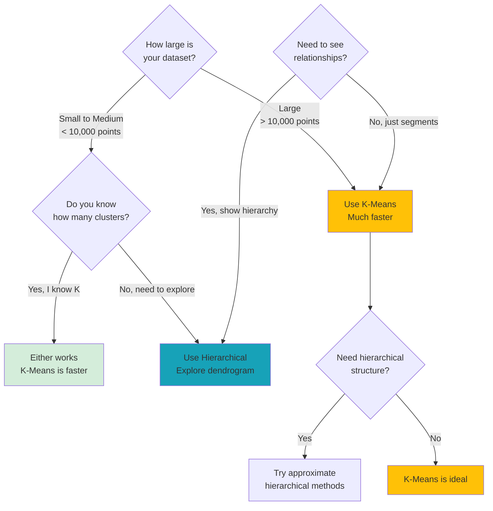

---

## 🎬 Real-World Example: Customer Segmentation

### Scenario: E-commerce Company with 1M Customers

**Decision Flow:**

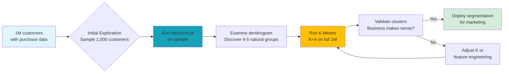

**Strategy: Use both methods complementarily**

1. **Hierarchical on sample** → Discover structure, choose K
2. **K-Means on full data** → Scale efficiently

---

## 🔍 Evaluation: How Do You Know If Clustering Is Good?

### Internal Metrics (No ground truth needed)

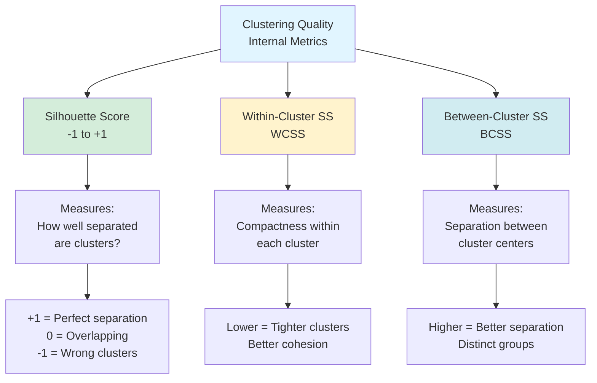

**Silhouette Score Formula:**

For each point i:

```
s(i) = (b(i) - a(i)) / max{a(i), b(i)}

where:
a(i) = average distance to other points in same cluster
b(i) = average distance to points in nearest different cluster
```

---

## 🎯 Practical Implementation Checklist

### Before You Cluster:

```mermaid
graph TD
    A[Raw Data] --> B{Data<br/>Preprocessing}
    
    B --> C[Scale/Normalize<br/>Features]
    C --> C1[K-Means is distance-based<br/>Scale matters!]
    
    B --> D[Handle Missing<br/>Values]
    D --> D1[Impute or remove<br/>No NaNs allowed]
    
    B --> E[Remove or<br/>Transform Outliers]
    E --> E1[Outliers distort<br/>cluster centers]
    
    B --> F[Select Relevant<br/>Features]
    F --> F1[Curse of dimensionality<br/>More features ≠ better]
    
    C --> G[Ready for Clustering]
    D --> G
    E --> G
    F --> G
    
    style A fill:#e1f5ff
    style G fill:#d4edda
    style C1 fill:#fff3cd
    style D1 fill:#fff3cd
    style E1 fill:#fff3cd
    style F1 fill:#fff3cd
```

---

## 🚀 Your Clustering Workflow

```mermaid
graph TD
    Start[Business Problem:<br/>Find natural groups] --> A[Exploratory Analysis<br/>Visualize data]
    
    A --> B{Dataset size?}
    B -->|Small| C[Hierarchical<br/>on full dataset]
    B -->|Large| D[Hierarchical<br/>on sample]
    
    C --> E[Examine dendrogram<br/>Identify K]
    D --> E
    
    E --> F[K-Means with<br/>chosen K]
    
    F --> G[Evaluate:<br/>Silhouette, WCSS, BCSS]
    
    G --> H{Quality<br/>acceptable?}
    H -->|No| I[Adjust K or<br/>feature engineering]
    I --> F
    
    H -->|Yes| J[Interpret clusters<br/>Business meaning]
    J --> K[Validate with<br/>domain experts]
    K --> L{Makes business<br/>sense?}
    
    L -->|No| I
    L -->|Yes| M[Deploy & Monitor<br/>Cluster assignments]
    
    style Start fill:#e1f5ff
    style M fill:#d4edda
    style H fill:#fff3cd
    style L fill:#fff3cd
```

---

## 🎓 Key Takeaways for Your ML Journey

### K-Means: The Speedster

✅ **When to use:** Large datasets, known K, spherical clusters  
✅ **Advantage:** Fast, scalable, simple  
⚠️ **Watch out:** Sensitive to initialization, assumes spherical shapes

### Hierarchical: The Explorer

✅ **When to use:** Small datasets, unknown K, need hierarchy  
✅ **Advantage:** No K needed, deterministic, reveals structure  
⚠️ **Watch out:** Slow, doesn't scale, greedy merging

### The Golden Rule

**Start with exploration (hierarchical on sample) → Scale with K-Means (full data)**

---

## 🔮 Connection to Your Healthcare AI Research

**Where clustering matters in healthcare AI adoption:**

1. **Patient Stratification:** Discover patient subgroups with similar characteristics (not predefined by diagnosis codes)
    
2. **Clinical Pathway Discovery:** Cluster treatment sequences to find common care patterns
    
3. **Hospital Segmentation:** Group hospitals by adoption readiness for AI implementation
    
4. **Provider Behavior Patterns:** Identify physician clusters by prescribing patterns (for AI recommendation systems)
    
5. **Anomaly Detection Foundation:** Patients far from all clusters = potential outliers for review
    

**Key insight:** Unsupervised learning like clustering helps you discover patterns you didn't know to look for—critical when implementing AI in complex healthcare systems where edge cases matter.

---

_Now you're ready to understand ensemble methods—which combine multiple models just like clustering combines multiple data points into meaningful groups!_

# Clustering Quality Metrics: The Complete Visual Guide

**Understanding Cohesion, Separation, and Silhouette Coefficient**

---

## 🎯 The Central Challenge: Measuring "Good" Clustering

### The Fundamental Problem

You've clustered your data. Now what? How do you know if your clusters are **meaningful**?

**In supervised learning:** You have ground truth labels → Calculate accuracy, precision, recall  
**In unsupervised learning:** No ground truth labels → How do you measure success? 🤔

```mermaid
graph TD
    A[Supervised Learning] --> B[Ground Truth Labels<br/>Known categories]
    B --> C[Compare predictions<br/>to actual labels]
    C --> D[Accuracy = 85%<br/>Clear answer!]
    
    E[Unsupervised Learning<br/>Clustering] --> F[No Ground Truth<br/>Unknown categories]
    F --> G[???<br/>How do we measure quality?]
    G --> H[Internal Validation Metrics<br/>Cohesion & Separation]
    
    style A fill:#d4edda
    style E fill:#fff3cd
    style D fill:#d4edda
    style H fill:#e1f5ff
```

**The answer:** Measure the **internal structure** of your clusters.

---

## 🎨 The Two Pillars of Good Clustering

### Visual Intuition: A Party Analogy

Imagine organizing people at a networking event:

```mermaid
graph TD
    subgraph "Good Clustering = Good Party Organization"
    A[Each conversation group<br/>talks among themselves<br/>HIGH COHESION]
    B[Different groups are<br/>clearly separated in space<br/>HIGH SEPARATION]
    end
    
    subgraph "Bad Clustering = Chaotic Party"
    C[People in same group<br/>spread far apart<br/>LOW COHESION]
    D[Different groups<br/>overlapping and mixed<br/>LOW SEPARATION]
    end
    
    A --> E[✅ Tight-knit groups]
    B --> E
    C --> F[❌ Poorly defined groups]
    D --> F
    
    style A fill:#d4edda
    style B fill:#d4edda
    style C fill:#f8d7da
    style D fill:#f8d7da
    style E fill:#d4edda
    style F fill:#f8d7da
```

### The Golden Rules

```mermaid
mindmap
  root((Good<br/>Clustering))
    Cohesion<br/>Within-Cluster
      Points close together
      Low variance
      Tight groups
      Homogeneous
    Separation<br/>Between-Cluster
      Clusters far apart
      Clear boundaries
      Distinct groups
      Heterogeneous
```

**Goal:** Maximize both cohesion AND separation simultaneously.

---

## 🔵 Cohesion (Within-Cluster Quality)

### What Is Cohesion?

**Definition:** How similar are the data points **within** the same cluster?

**Intuition:** If you're in the "tech professionals" cluster at a party, are you all actually tech professionals, or is there a random accountant and a chef mixed in?

### Measuring Cohesion: Within-Cluster Sum of Squares (WCSS)

```mermaid
graph TD
    subgraph "High Cohesion Cluster"
    C1["⭐ Cluster Center<br/>μ₁"]
    P1["● Point 1<br/>close to center"]
    P2["● Point 2<br/>close to center"]
    P3["● Point 3<br/>close to center"]
    P4["● Point 4<br/>close to center"]
    
    C1 -.short distance.-> P1
    C1 -.short distance.-> P2
    C1 -.short distance.-> P3
    C1 -.short distance.-> P4
    end
    
    subgraph "Low Cohesion Cluster"
    C2["⭐ Cluster Center<br/>μ₂"]
    Q1["● Point A<br/>FAR from center"]
    Q2["● Point B<br/>FAR from center"]
    Q3["● Point C<br/>FAR from center"]
    Q4["● Point D<br/>FAR from center"]
    
    C2 -.LONG distance.-> Q1
    C2 -.LONG distance.-> Q2
    C2 -.LONG distance.-> Q3
    C2 -.LONG distance.-> Q4
    end
    
    style C1 fill:#d4edda
    style C2 fill:#f8d7da
```

### The Mathematics: WCSS Formula

**For a single cluster:**

```
WCSS = Σ (distance from point to cluster center)²
```

**More formally:**

```
WCSS_k = Σ ||xᵢ - μₖ||²
         i∈Cₖ

where:
- xᵢ = each point in cluster k
- μₖ = centroid (mean) of cluster k
- ||·|| = Euclidean distance
- Cₖ = set of all points in cluster k
```

**For all clusters:**

```
Total WCSS = Σ WCSS_k
             k=1 to K
```

### Visual Example: Calculating WCSS

```mermaid
graph TD
    subgraph "Customer Spending Cluster"
    direction TB
    Center["⭐ Center: $100"]
    P1["👤 Customer A: $95<br/>Distance² = (95-100)² = 25"]
    P2["👤 Customer B: $105<br/>Distance² = (105-100)² = 25"]
    P3["👤 Customer C: $90<br/>Distance² = (90-100)² = 100"]
    P4["👤 Customer D: $110<br/>Distance² = (110-100)² = 100"]
    end
    
    Center --> P1
    Center --> P2
    Center --> P3
    Center --> P4
    
    Calc["WCSS = 25 + 25 + 100 + 100 = 250"]
    
    P1 --> Calc
    P2 --> Calc
    P3 --> Calc
    P4 --> Calc
    
    style Center fill:#ffc107
    style Calc fill:#e1f5ff
```

**Interpretation:**

- **Lower WCSS** = Higher cohesion = Points tightly clustered = GOOD ✅
- **Higher WCSS** = Lower cohesion = Points spread out = BAD ❌

---

### Alternative Cohesion Metric: Average Distance to Centroid

```
Cohesion_k = (1/|Cₖ|) Σ distance(xᵢ, μₖ)
                      i∈Cₖ
```

This gives you the **average** distance from points to their cluster center.

**Lower average distance = Better cohesion**

---

## 🔴 Separation (Between-Cluster Quality)

### What Is Separation?

**Definition:** How different are the clusters **from each other**?

**Intuition:** At the party, is the "tech professionals" group clearly distinct from the "artists" group, or are they all mingling in the same space?

### Measuring Separation: Between-Cluster Sum of Squares (BCSS)

```mermaid
graph LR
    subgraph "Good Separation"
    C1["⭐ Cluster 1<br/>Tech Pros<br/>Center at (10, 10)"]
    C2["⭐ Cluster 2<br/>Artists<br/>Center at (100, 100)"]
    
    C1 -.LARGE distance.-> C2
    end
    
    subgraph "Poor Separation"
    C3["⭐ Cluster 1<br/>Center at (50, 50)"]
    C4["⭐ Cluster 2<br/>Center at (52, 51)"]
    
    C3 -.tiny distance.-> C4
    end
    
    style C1 fill:#d4edda
    style C2 fill:#d4edda
    style C3 fill:#f8d7da
    style C4 fill:#f8d7da
```

### The Mathematics: BCSS Formula

**Concept:** Measure how far each cluster centroid is from the **overall data centroid**.

```
BCSS = Σ nₖ × ||μₖ - μ_overall||²
       k=1 to K

where:
- nₖ = number of points in cluster k
- μₖ = centroid of cluster k
- μ_overall = centroid of ALL data
- ||·|| = Euclidean distance
```

**Why multiply by nₖ?** Larger clusters should have more influence on the metric.

### Visual Example: Calculating BCSS

```mermaid
graph TD
    subgraph "Two Customer Segments"
    Overall["🎯 Overall Center<br/>All Customers<br/>$100"]
    
    C1["⭐ Budget Cluster<br/>Center: $30<br/>n=100 customers"]
    C2["⭐ Premium Cluster<br/>Center: $200<br/>n=50 customers"]
    end
    
    Overall -.Distance = 70.-> C1
    Overall -.Distance = 100.-> C2
    
    Calc1["Budget contribution:<br/>100 × (30-100)² = 100 × 4,900 = 490,000"]
    Calc2["Premium contribution:<br/>50 × (200-100)² = 50 × 10,000 = 500,000"]
    Result["BCSS = 490,000 + 500,000 = 990,000"]
    
    C1 --> Calc1
    C2 --> Calc2
    Calc1 --> Result
    Calc2 --> Result
    
    style Overall fill:#e1f5ff
    style C1 fill:#ffc107
    style C2 fill:#17a2b8
    style Result fill:#d4edda
```

**Interpretation:**

- **Higher BCSS** = Better separation = Clusters far from overall center = GOOD ✅
- **Lower BCSS** = Poor separation = Clusters close to overall center = BAD ❌

---

### The Beautiful Symmetry: Total Variance Decomposition

**One of the most elegant results in clustering theory:**

```
Total Sum of Squares (TSS) = WCSS + BCSS
```

**Visual Proof:**

```mermaid
graph TD
    A[Total Variance in Data<br/>TSS] --> B[Variance WITHIN clusters<br/>WCSS<br/>Unexplained by clustering]
    A --> C[Variance BETWEEN clusters<br/>BCSS<br/>Explained by clustering]
    
    B --> D[What clustering<br/>hasn't captured]
    C --> E[What clustering<br/>has captured]
    
    style A fill:#e1f5ff
    style B fill:#f8d7da
    style C fill:#d4edda
```

**What this means:**

- **TSS is constant** (fixed by your data)
- **Minimizing WCSS** automatically **maximizes BCSS**
- They're two sides of the same coin!

**The clustering optimization goal:**

```
Minimize WCSS ⟺ Maximize BCSS ⟺ Maximize clustering quality
```

---

## 🎯 The Complete Picture: Cohesion + Separation

### Visual Comparison of Clustering Quality

```mermaid
graph TD
    subgraph "Excellent Clustering"
    direction LR
    A1[😊 😊 😊<br/>😊 😊 😊]
    A2[🎨 🎨 🎨<br/>🎨 🎨 🎨]
    A3[💼 💼 💼<br/>💼 💼 💼]
    end
    
    subgraph "Poor Clustering"
    direction LR
    B1[😊 🎨 💼<br/>😊 🎨 💼]
    B2[😊 💼 🎨<br/>🎨 😊 💼]
    B3[💼 😊 🎨<br/>🎨 💼 😊]
    end
    
    A1 -.large gap.-> A2
    A2 -.large gap.-> A3
    
    B1 -.overlap.-> B2
    B2 -.overlap.-> B3
    
    Good["✅ High Cohesion<br/>✅ High Separation<br/>✅ WCSS Low<br/>✅ BCSS High"]
    Bad["❌ Low Cohesion<br/>❌ Low Separation<br/>❌ WCSS High<br/>❌ BCSS Low"]
    
    A1 --> Good
    A2 --> Good
    A3 --> Good
    
    B1 --> Bad
    B2 --> Bad
    B3 --> Bad
    
    style Good fill:#d4edda
    style Bad fill:#f8d7da
```

---

## 💎 The Silhouette Coefficient: The Ultimate Quality Metric

### Why Silhouette? The Missing Piece

**Problem with WCSS/BCSS alone:**

- Different scales make comparison difficult
- No intuitive interpretation ("Is WCSS=5000 good?")
- Can't compare across different datasets

**Silhouette solution:** A normalized score from **-1 to +1** that measures **both cohesion and separation for each point**.

### The Core Intuition

**The Silhouette Coefficient asks:**

> "Is this point more similar to its own cluster, or to the nearest neighboring cluster?"

```mermaid
graph TD
    A[For each point:<br/>Answer two questions] --> B[Q1: How close am I<br/>to my own cluster?<br/>Measure: a]
    A --> C[Q2: How close am I<br/>to the nearest OTHER cluster?<br/>Measure: b]
    
    B --> D[Calculate:<br/>s = b - a / max a, b]
    C --> D
    
    D --> E{Interpret s}
    E -->|s ≈ +1| F[Point well-clustered<br/>Far from other clusters]
    E -->|s ≈ 0| G[Point on boundary<br/>Between clusters]
    E -->|s ≈ -1| H[Point mis-clustered<br/>Closer to wrong cluster]
    
    style F fill:#d4edda
    style G fill:#fff3cd
    style H fill:#f8d7da
```

---

### The Mathematical Definition

**For a single point i:**

```
        b(i) - a(i)
s(i) = ─────────────
       max{a(i), b(i)}

where:

a(i) = average distance from point i to all other points in its own cluster
       (measures COHESION - how well i fits in its cluster)

b(i) = average distance from point i to all points in the nearest neighboring cluster
       (measures SEPARATION - how far i is from the next best cluster)
```

**For a cluster k:**

```
Silhouette_k = (1/|Cₖ|) Σ s(i)
                        i∈Cₖ

Average silhouette of all points in cluster k
```

**For the entire clustering:**

```
Silhouette_overall = (1/n) Σ s(i)
                           i=1 to n

Average silhouette across all points
```

---

### Step-by-Step Visual Calculation

Let's calculate silhouette for one customer in a spending segmentation:

```mermaid
graph TD
    subgraph "Cluster 1: Budget Shoppers"
    Target["👤 ME: $25"]
    P1["👤 $20"]
    P2["👤 $30"]
    P3["👤 $22"]
    end
    
    subgraph "Cluster 2: Premium Shoppers"
    Q1["👤 $200"]
    Q2["👤 $220"]
    Q3["👤 $180"]
    Q4["👤 $210"]
    end
    
    subgraph "Cluster 3: Mid-tier Shoppers"
    R1["👤 $100"]
    R2["👤 $110"]
    R3["👤 $95"]
    end
    
    style Target fill:#ffc107
    style P1 fill:#d4edda
    style P2 fill:#d4edda
    style P3 fill:#d4edda
```

**Step 1: Calculate a(i) - Cohesion**

```
Distances within my cluster (Cluster 1):
- Distance to $20: |25 - 20| = 5
- Distance to $30: |25 - 30| = 5
- Distance to $22: |25 - 22| = 3

a(i) = (5 + 5 + 3) / 3 = 13/3 ≈ 4.33
```

**This measures: How well do I fit with my own cluster?**

```mermaid
graph LR
    Me["👤 ME: $25<br/>in Cluster 1"] -.avg distance = 4.33.-> Others["Other Budget<br/>Shoppers"]
    
    Note["Small a = Good cohesion<br/>I'm close to my cluster mates ✅"]
    
    Others --> Note
    
    style Me fill:#ffc107
    style Note fill:#d4edda
```

---

**Step 2: Calculate b(i) - Separation**

```
Average distance to Cluster 2 (Premium):
- To $200: |25 - 200| = 175
- To $220: |25 - 220| = 195
- To $180: |25 - 180| = 155
- To $210: |25 - 210| = 185
Average: (175 + 195 + 155 + 185) / 4 = 177.5

Average distance to Cluster 3 (Mid-tier):
- To $100: |25 - 100| = 75
- To $110: |25 - 110| = 85
- To $95: |25 - 95| = 70
Average: (75 + 85 + 70) / 3 = 76.67

b(i) = min(177.5, 76.67) = 76.67
(Nearest other cluster is Mid-tier)
```

**This measures: How far am I from the next best cluster?**

```mermaid
graph TD
    Me["👤 ME: $25"] --> C2["Cluster 2: Premium<br/>Avg distance = 177.5"]
    Me --> C3["Cluster 3: Mid-tier<br/>Avg distance = 76.67"]
    
    C3 --> Nearest["✓ This is my nearest<br/>other cluster<br/>b = 76.67"]
    
    style Me fill:#ffc107
    style C3 fill:#fff3cd
    style Nearest fill:#e1f5ff
```

---

**Step 3: Calculate Silhouette s(i)**

```
s(i) = (b(i) - a(i)) / max{a(i), b(i)}

s(i) = (76.67 - 4.33) / max{4.33, 76.67}

s(i) = 72.34 / 76.67

s(i) ≈ 0.943
```

**Interpretation:**

```mermaid
graph TD
    Score["Silhouette = 0.943"] --> Analysis
    
    Analysis[Analysis:<br/>Very close to +1]
    
    Analysis --> Cohesion["✅ Strong cohesion:<br/>a = 4.33<br/>Close to my cluster"]
    
    Analysis --> Separation["✅ Strong separation:<br/>b = 76.67<br/>Far from other clusters"]
    
    Analysis --> Conclusion["✅ Excellent clustering<br/>This point is well-placed"]
    
    style Score fill:#ffc107
    style Conclusion fill:#d4edda
```

---

### The Silhouette Score Spectrum

```mermaid
graph LR
    A["-1"] --> B["-0.5"] --> C["0"] --> D["+0.5"] --> E["+1"]
    
    A --> A1["Completely<br/>wrong cluster"]
    B --> B1["Probably<br/>wrong cluster"]
    C --> C1["On the<br/>boundary"]
    D --> D1["Well<br/>clustered"]
    E --> E1["Perfectly<br/>clustered"]
    
    style A fill:#f8d7da
    style B fill:#f8d7da
    style C fill:#fff3cd
    style D fill:#d4edda
    style E fill:#d4edda
```

**Detailed Interpretation:**

|Silhouette Range|Meaning|Action|
|---|---|---|
|**0.71 to 1.0**|Strong, well-separated clusters|Excellent! Keep clustering|
|**0.51 to 0.70**|Reasonable structure found|Good clustering, but may improve|
|**0.26 to 0.50**|Weak, overlapping clusters|Consider different K or features|
|**< 0.25**|No substantial structure|Clustering may not be appropriate|
|**Negative**|Points assigned to wrong clusters|Serious problems with clustering|

---

### Silhouette Plot: The Diagnostic Tool

**Visual representation of clustering quality:**

```mermaid
graph TD
    subgraph "Silhouette Plot for 3 Clusters"
    C1["Cluster 1<br/>Avg = 0.85"]
    C2["Cluster 2<br/>Avg = 0.72"]
    C3["Cluster 3<br/>Avg = 0.45"]
    end
    
    C1 --> V1["Each horizontal bar<br/>= one data point<br/>Length = silhouette value"]
    C2 --> V1
    C3 --> V1
    
    V1 --> Analysis["What to look for:<br/>✓ Wide bars = good<br/>✓ All positive = good<br/>✗ Narrow bars = poor<br/>✗ Negative values = mis-clustered"]
    
    style C1 fill:#d4edda
    style C2 fill:#d4edda
    style C3 fill:#fff3cd
    style Analysis fill:#e1f5ff
```

**Example Silhouette Plot:**

```
        Silhouette Coefficient
   -0.2  0.0  0.2  0.4  0.6  0.8  1.0
    |____|____|____|____|____|____|
C1  ████████████████████████████████  Avg: 0.85
    ██████████████████████████████
    ████████████████████████████
    
C2  ████████████████████████          Avg: 0.72
    ██████████████████████████
    ████████████████████
    
C3  ████████████                      Avg: 0.45
    ██████████
    ████████████
   ████                               ← Negative! Problem point
```

**Reading the plot:**

- **Thick, long bars** → Well-defined clusters
- **Thin, short bars** → Weak, diffuse clusters
- **Bars crossing zero** → Mis-clustered points
- **Similar heights** → Balanced cluster quality
- **Very different heights** → Some clusters much better than others

---

## 🎓 The Decision Framework: Using These Metrics

```mermaid
graph TD
    Start[Finished Clustering] --> Q1{What's the<br/>overall silhouette?}
    
    Q1 -->|more than 0.70| Good[✅ Strong clustering]
    Q1 -->|0.50-0.70| Okay[⚠️ Reasonable clustering]
    Q1 -->|< 0.50| Bad[❌ Weak clustering]
    
    Good --> Q2{WCSS + BCSS<br/>patterns?}
    Okay --> Improve
    Bad --> Improve
    
    Q2 -->|WCSS low<br/>BCSS high| Validate[Validate with<br/>domain experts]
    Q2 -->|Mixed signals| Improve
    
    Improve[Try improvements] --> I1[Adjust K]
    Improve --> I2[Feature engineering]
    Improve --> I3[Different algorithm]
    Improve --> I4[Data preprocessing]
    
    I1 --> Rerun[Rerun clustering]
    I2 --> Rerun
    I3 --> Rerun
    I4 --> Rerun
    
    Rerun --> Q1
    
    Validate --> Deploy[Deploy clustering]
    
    style Good fill:#d4edda
    style Okay fill:#fff3cd
    style Bad fill:#f8d7da
    style Deploy fill:#d4edda
```

---

## 📊 Practical Example: Evaluating Real Clustering

### Scenario: E-commerce Customer Segmentation

**Setup:**

- 1,000 customers
- Features: Purchase frequency, average order value, recency
- Tried K-Means with K=4

**Results:**

```mermaid
graph TD
    subgraph "Cluster Quality Metrics"
    M1["Total WCSS = 12,500<br/>Lower is better"]
    M2["Total BCSS = 45,000<br/>Higher is better"]
    M3["Overall Silhouette = 0.68<br/>Range: -1 to +1"]
    end
    
    subgraph "Per-Cluster Breakdown"
    C1["Cluster 1: Frequent Buyers<br/>Size: 150<br/>Silhouette: 0.81<br/>WCSS: 1,200"]
    
    C2["Cluster 2: Occasional Buyers<br/>Size: 400<br/>Silhouette: 0.74<br/>WCSS: 5,800"]
    
    C3["Cluster 3: Big Spenders<br/>Size: 100<br/>Silhouette: 0.79<br/>WCSS: 900"]
    
    C4["Cluster 4: Churned Users<br/>Size: 350<br/>Silhouette: 0.45<br/>WCSS: 4,600"]
    end
    
    M1 --> Analysis
    M2 --> Analysis
    M3 --> Analysis
    
    C1 --> Analysis
    C2 --> Analysis
    C3 --> Analysis
    C4 --> Analysis
    
    Analysis["Interpretation:<br/>✓ Overall silhouette 0.68 = Reasonable<br/>✓ Clusters 1-3 strong (>0.70)<br/>⚠️ Cluster 4 weak (0.45)<br/>→ Action: Investigate Cluster 4"]
    
    style C1 fill:#d4edda
    style C2 fill:#d4edda
    style C3 fill:#d4edda
    style C4 fill:#fff3cd
    style Analysis fill:#e1f5ff
```

**Action Plan:**

```mermaid
graph LR
    Problem["Cluster 4 has<br/>low silhouette 0.45"] --> Investigate
    
    Investigate[Investigate] --> A[Plot Cluster 4 points<br/>visually]
    Investigate --> B[Check for outliers]
    Investigate --> C[Try K=5 or K=3]
    Investigate --> D[Add/remove features]
    
    A --> Result
    B --> Result
    C --> Result
    D --> Result
    
    Result[Recompute metrics<br/>and compare]
    
    style Problem fill:#fff3cd
    style Result fill:#e1f5ff
```

---

## 🔍 Advanced: Choosing K Using Silhouette

### The Silhouette Method for K Selection

Unlike the elbow method (which uses WCSS), silhouette gives you a **quality-based** approach:

```mermaid
graph TD
    A[Try K=2, 3, 4, 5, 6...] --> B[Calculate average<br/>silhouette for each K]
    B --> C[Plot Silhouette vs K]
    C --> D[Choose K with<br/>HIGHEST silhouette]
    
    style D fill:#d4edda
```

**Visual Comparison:**

```
Average Silhouette Score
1.0 │
    │
0.8 │          ●  ← Peak at K=3
    │        ╱   ╲
0.6 │      ●       ●
    │    ╱           ╲
0.4 │  ●               ●
    │
0.2 │●                   ●
    └────────────────────────
      2  3  4  5  6  7  8  K

Choose K=3 (highest silhouette)
```

**Why this is better than elbow method:**

- Elbow method: Looks at WCSS (always decreases, subjective elbow)
- Silhouette method: Looks at clustering **quality** (peaks at optimal K)

---

## 💡 Key Insights for Your ML Journey

### The Metrics Relationship

```mermaid
graph TD
    A[Clustering Quality] --> B[Cohesion<br/>WCSS]
    A --> C[Separation<br/>BCSS]
    
    B --> D[Within-cluster<br/>compactness]
    C --> E[Between-cluster<br/>distinctness]
    
    D --> F[Silhouette<br/>coefficient]
    E --> F
    
    F --> G[Unified score:<br/>-1 to +1]
    G --> H{Decision}
    
    H -->|>0.70| I[✅ Deploy]
    H -->|0.50-0.70| J[⚠️ Improve]
    H -->|<0.50| K[❌ Rethink]
    
    style A fill:#e1f5ff
    style F fill:#ffc107
    style I fill:#d4edda
    style J fill:#fff3cd
    style K fill:#f8d7da
```

### Quick Reference Table

|Metric|Formula|Range|Interpretation|Goal|
|---|---|---|---|---|
|**WCSS**|Σ(x - μ)²|0 to ∞|Lower = tighter clusters|**Minimize**|
|**BCSS**|Σn(μₖ - μ)²|0 to TSS|Higher = better separation|**Maximize**|
|**Silhouette**|(b-a)/max(a,b)|-1 to +1|Higher = better quality|**Maximize**|

---

## 🎯 Healthcare AI Connection

### Why These Metrics Matter for Your Research

**In healthcare AI adoption, clustering quality metrics help you:**

1. **Patient Stratification Validation**
    
    - Silhouette > 0.70: Strong patient subgroups discovered
    - Silhouette < 0.50: May need more clinical features
2. **Treatment Protocol Discovery**
    
    - High BCSS: Distinct treatment pathways identified
    - Low WCSS within pathways: Patients similar within each pathway
3. **Hospital Segmentation for AI Rollout**
    
    - Well-separated clusters (high silhouette): Clear adoption profiles
    - Can target interventions to each hospital type
4. **Quality Control**
    
    - Negative silhouettes: Flag data quality issues
    - Decreasing silhouette over time: Concept drift detection

**Example Application:**

```mermaid
graph TD
    A[Cluster 500 hospitals<br/>by AI readiness] --> B[Calculate silhouette<br/>for each hospital]
    
    B --> C{Silhouette<br/>score?}
    
    C -->|more than 0.70| D[Hospital clearly belongs<br/>to a readiness group<br/>Tailor intervention]
    
    C -->|0.3-0.7| E[Hospital has mixed signals<br/>Needs custom assessment]
    
    C -->|<0.3 or negative| F[Hospital doesn't fit pattern<br/>Flag for manual review]
    
    style D fill:#d4edda
    style E fill:#fff3cd
    style F fill:#f8d7da
```

---

## 🎬 Putting It All Together: Your Workflow

```mermaid
graph TD
    Start[Run Clustering] --> Metrics[Calculate Metrics]
    
    Metrics --> M1[WCSS per cluster]
    Metrics --> M2[BCSS total]
    Metrics --> M3[Silhouette overall]
    Metrics --> M4[Silhouette per cluster]
    Metrics --> M5[Silhouette per point]
    
    M1 --> Analyze
    M2 --> Analyze
    M3 --> Analyze
    M4 --> Analyze
    M5 --> Analyze
    
    Analyze[Analyze Results] --> Q1{Overall<br/>silhouette?}
    
    Q1 -->|>0.70| Check[Check individual<br/>cluster silhouettes]
    Q1 -->|<0.70| Improve
    
    Check --> Q2{Any cluster<br/><0.50?}
    Q2 -->|No| Good[✅ All clusters strong]
    Q2 -->|Yes| Improve
    
    Good --> Q3{WCSS/BCSS<br/>reasonable?}
    Q3 -->|Yes| Deploy[Deploy clustering]
    Q3 -->|No| Improve
    
    Improve[Improvement Actions] --> A1[Try different K]
    Improve --> A2[Feature engineering]
    Improve --> A3[Remove outliers]
    Improve --> A4[Try different algorithm]
    
    A1 --> Start
    A2 --> Start
    A3 --> Start
    A4 --> Start
    
    style Good fill:#d4edda
    style Deploy fill:#d4edda
    style Improve fill:#fff3cd
```

---

## 📚 Summary: The Three Pillars

```mermaid
mindmap
  root((Clustering<br/>Quality))
    Cohesion
      WCSS metric
      Low is good
      Points tight within cluster
      Average distance to centroid
    Separation
      BCSS metric
      High is good
      Clusters far apart
      Distance from overall mean
    Silhouette
      Combines both
      Range: -1 to +1
      >0.70 is excellent
      Per-point diagnostic
```

**Remember:**

✅ **Good clustering** = High cohesion (low WCSS) + High separation (high BCSS) + High silhouette (>0.70)

❌ **Poor clustering** = Low cohesion (high WCSS) + Low separation (low BCSS) + Low silhouette (<0.50)

🎯 **Your goal:** Maximize silhouette by finding the right K, features, and algorithm!

---

_Now you understand not just HOW to cluster, but how to measure if you've clustered WELL!_

# Ensemble Methods: The Complete Visual Guide

**How Combining Weak Learners Creates Powerful Predictions**

---

## 🎯 The Central Paradox: Why Crowds Are Smarter Than Experts

### The Provocative Question

**You've learned that decision trees overfit.** They memorize training data and perform poorly on new data. They're "weak learners."

**So here's the puzzle:** What if you took 100 terrible decision trees and combined their predictions? Would you get:

- A) An even worse prediction (garbage × 100 = more garbage)?
- B) A surprisingly accurate prediction (wisdom of crowds)?

**The answer: B** 🤯

This is ensemble methods: **combining multiple weak models to create a strong model**.

```mermaid
graph TD
    A[Single Decision Tree] --> B[Overfits training data<br/>High variance<br/>Poor generalization]
    
    C[100 Decision Trees<br/>Combined] --> D[Reduces overfitting<br/>Low variance<br/>Excellent generalization]
    
    B --> E[❌ Weak Learner]
    D --> F[✅ Strong Learner]
    
    style A fill:#f8d7da
    style C fill:#d4edda
    style E fill:#f8d7da
    style F fill:#d4edda
```

---

## 🧠 The Core Intuition: Wisdom of Crowds

### Real-World Analogy

**Scenario:** You're at a county fair. There's a jar with 1,000 jellybeans. Everyone guesses the number.

```mermaid
graph TD
    subgraph "Individual Guesses Vary Wildly"
    P1["Person 1: 750<br/>Error: -250"]
    P2["Person 2: 1,200<br/>Error: +200"]
    P3["Person 3: 900<br/>Error: -100"]
    P4["Person 4: 1,150<br/>Error: +150"]
    P5["Person 5: 800<br/>Error: -200"]
    end
    
    Avg["Average of All Guesses:<br/>(750+1200+900+1150+800)/5 = 960<br/>Error: -40"]
    
    P1 --> Avg
    P2 --> Avg
    P3 --> Avg
    P4 --> Avg
    P5 --> Avg
    
    Truth["True Count: 1,000"]
    
    Avg --> Compare["Average is MUCH closer<br/>than most individuals!"]
    Truth --> Compare
    
    style P1 fill:#f8d7da
    style P2 fill:#f8d7da
    style P3 fill:#f8d7da
    style P4 fill:#f8d7da
    style P5 fill:#f8d7da
    style Avg fill:#d4edda
    style Compare fill:#e1f5ff
```

**Key insight:** Individual guesses have random errors that cancel out when averaged. The crowd's average is more accurate than most individuals.

**This is exactly how ensemble methods work!**

---

### The Mathematical Magic: Variance Reduction

**Why does averaging help?**

```
Variance of average of N independent models = Variance of single model / N
```

**If each model has variance σ²:**

- 1 model: Variance = σ²
- 10 models averaged: Variance = σ²/10
- 100 models averaged: Variance = σ²/100

**Visual proof:**

```mermaid
graph LR
    A[Single Model<br/>Variance = σ²] --> B[10 Models<br/>Variance = σ²/10]
    B --> C[100 Models<br/>Variance = σ²/100]
    
    A --> A1[High variance<br/>Predictions fluctuate wildly]
    B --> B1[Medium variance<br/>More stable predictions]
    C --> C1[Low variance<br/>Very stable predictions]
    
    style A fill:#f8d7da
    style B fill:#fff3cd
    style C fill:#d4edda
```

**The catch:** This only works if models make **different errors** (are diverse/independent).

---

## 🎭 The Two Main Ensemble Strategies

```mermaid
graph TD
    A[Ensemble Methods<br/>How to create diversity?]
    
    A --> B[Bagging<br/>Bootstrap Aggregating]
    A --> C[Boosting<br/>Sequential Learning]
    
    B --> B1[Train models in PARALLEL<br/>on different data samples]
    B1 --> B2[Each model independent<br/>Errors uncorrelated]
    B2 --> B3[Combine by VOTING/AVERAGING]
    
    C --> C1[Train models SEQUENTIALLY<br/>each correcting previous errors]
    C1 --> C2[Each model dependent<br/>Focuses on hard examples]
    C2 --> C3[Combine by WEIGHTED VOTING]
    
    style B fill:#d4edda
    style C fill:#ffc107
```

---

## 🎒 Bagging: Bootstrap Aggregating

### The Core Idea: Sample Diversity

**Problem:** We have one dataset. How do we train different models?

**Solution:** Create multiple datasets through **bootstrap sampling** (sampling with replacement).

```mermaid
graph TD
    Original["Original Dataset<br/>1000 customers"] --> Sample
    
    Sample[Bootstrap Sampling<br/>Draw 1000 random samples<br/>WITH replacement] --> D1
    Sample --> D2
    Sample --> D3
    Sample --> D4
    
    D1["Dataset 1<br/>Some customers<br/>appear 2-3 times<br/>Some missing"]
    D2["Dataset 2<br/>Different duplicates<br/>Different missing"]
    D3["Dataset 3<br/>Different mix"]
    D4["Dataset 4<br/>Different mix"]
    
    D1 --> M1[Model 1]
    D2 --> M2[Model 2]
    D3 --> M3[Model 3]
    D4 --> M4[Model 4]
    
    M1 --> Combine[Aggregate Predictions<br/>Voting or Averaging]
    M2 --> Combine
    M3 --> Combine
    M4 --> Combine
    
    Combine --> Final[Final Prediction]
    
    style Original fill:#e1f5ff
    style Sample fill:#fff3cd
    style Combine fill:#ffc107
    style Final fill:#d4edda
```

---

### Bootstrap Sampling: The Mechanism

**What is sampling WITH replacement?**

```mermaid
graph LR
    subgraph "Original Dataset"
    O1[Customer A]
    O2[Customer B]
    O3[Customer C]
    O4[Customer D]
    O5[Customer E]
    end
    
    subgraph "Bootstrap Sample 1"
    S1[Customer A]
    S2[Customer B]
    S3[Customer A ← duplicate!]
    S4[Customer D]
    S5[Customer A ← again!]
    end
    
    subgraph "Bootstrap Sample 2"
    T1[Customer C]
    T2[Customer E]
    T3[Customer E ← duplicate!]
    T4[Customer B]
    T5[Customer C ← again!]
    end
    
    O1 -.-> S1
    O2 -.-> S2
    O1 -.-> S3
    O4 -.-> S4
    O1 -.-> S5
    
    O3 -.-> T1
    O5 -.-> T2
    O5 -.-> T3
    O2 -.-> T4
    O3 -.-> T5
    
    style S3 fill:#fff3cd
    style S5 fill:#fff3cd
    style T3 fill:#fff3cd
    style T5 fill:#fff3cd
```

**Key properties:**

1. Each bootstrap sample has **same size** as original (n samples)
2. Some data points appear **multiple times** (duplicates)
3. About **37% of data points are missing** from each sample (out-of-bag)
4. Each sample is **different** → trains different model

**Mathematical fact:** Each sample excludes ~37% of original data (these become "out-of-bag" samples for validation).

---

### Bagging Algorithm: Step-by-Step

```mermaid
graph TD
    Start[Original Training Data<br/>n samples] --> Loop{Repeat B times<br/>e.g., B=100}
    
    Loop --> S1[Create bootstrap sample<br/>Sample n points with replacement]
    S1 --> S2[Train decision tree<br/>on this sample]
    S2 --> S3[Store model b]
    S3 --> Loop
    
    Loop --> Predict[New Data Point<br/>Needs Prediction]
    
    Predict --> P1{Task Type?}
    
    P1 -->|Classification| C1[Each tree votes<br/>for a class]
    C1 --> C2[Count votes]
    C2 --> C3[Majority class wins]
    
    P1 -->|Regression| R1[Each tree predicts<br/>a number]
    R1 --> R2[Average all predictions]
    
    C3 --> Final[Final Prediction]
    R2 --> Final
    
    style Start fill:#e1f5ff
    style S2 fill:#fff3cd
    style Final fill:#d4edda
```

---

### Visual Example: Bagging for Classification

**Scenario:** Predicting if a customer will buy (Yes/No) based on age and income.

```mermaid
graph TD
    subgraph "Training 5 Trees on Bootstrap Samples"
    T1["Tree 1<br/>Trained on<br/>Bootstrap Sample 1"]
    T2["Tree 2<br/>Trained on<br/>Bootstrap Sample 2"]
    T3["Tree 3<br/>Trained on<br/>Bootstrap Sample 3"]
    T4["Tree 4<br/>Trained on<br/>Bootstrap Sample 4"]
    T5["Tree 5<br/>Trained on<br/>Bootstrap Sample 5"]
    end
    
    NewCustomer["🆕 New Customer<br/>Age: 35<br/>Income: $80K"]
    
    NewCustomer --> T1
    NewCustomer --> T2
    NewCustomer --> T3
    NewCustomer --> T4
    NewCustomer --> T5
    
    T1 --> V1["Vote: YES"]
    T2 --> V2["Vote: NO"]
    T3 --> V3["Vote: YES"]
    T4 --> V4["Vote: YES"]
    T5 --> V5["Vote: NO"]
    
    V1 --> Count["Tally Votes:<br/>YES: 3<br/>NO: 2"]
    V2 --> Count
    V3 --> Count
    V4 --> Count
    V5 --> Count
    
    Count --> Final["✅ Majority Vote: YES<br/>Customer will likely buy"]
    
    style NewCustomer fill:#e1f5ff
    style V1 fill:#d4edda
    style V3 fill:#d4edda
    style V4 fill:#d4edda
    style V2 fill:#f8d7da
    style V5 fill:#f8d7da
    style Final fill:#d4edda
```

**Notice:** Even though 2 trees disagreed, the ensemble gave a confident majority vote!

---

### Why Bagging Reduces Variance

**Single Decision Tree:**

```mermaid
graph TD
    A[Training Data] --> B[One Tree]
    B --> C[Overfits<br/>Memorizes noise]
    C --> D[High variance<br/>Different train sets<br/>→ very different trees]
    
    style C fill:#f8d7da
    style D fill:#f8d7da
```

**Bagged Ensemble:**

```mermaid
graph TD
    A[Training Data] --> B1[Tree 1<br/>Overfits Sample 1]
    A --> B2[Tree 2<br/>Overfits Sample 2]
    A --> B3[Tree 3<br/>Overfits Sample 3]
    
    B1 --> C[Average/Vote]
    B2 --> C
    B3 --> C
    
    C --> D[Overfitting cancelled out<br/>Low variance<br/>Better generalization]
    
    style B1 fill:#fff3cd
    style B2 fill:#fff3cd
    style B3 fill:#fff3cd
    style D fill:#d4edda
```

**The magic:** Each tree overfits **differently**. When averaged, the overfitting cancels out!

---

## 🌲 Random Forest: Bagging on Steroids

### The Problem with Plain Bagging

**Even with bootstrap samples, trees can be too similar:**

```mermaid
graph TD
    Problem["Problem: If one feature<br/>is very strong predictor"] --> Similar["All trees split on<br/>same feature first"]
    Similar --> Correlated["Trees become correlated<br/>Less diversity<br/>Less variance reduction"]
    
    style Problem fill:#fff3cd
    style Correlated fill:#f8d7da
```

**Example:** Predicting house prices. If "square footage" is the strongest predictor, all 100 trees will split on square footage first → trees look similar → less diversity.

---

### Random Forest Solution: Double Randomness

**Random Forest adds a second layer of randomization:**

```mermaid
graph TD
    A[Random Forest] --> R1[Randomness Layer 1:<br/>Bootstrap Sampling]
    A --> R2[Randomness Layer 2:<br/>Feature Randomization]
    
    R1 --> R1A[Each tree sees<br/>different data samples]
    
    R2 --> R2A[At each split,<br/>only consider random subset<br/>of features]
    
    R1A --> Diversity[Maximum Diversity]
    R2A --> Diversity
    
    Diversity --> Power[Powerful Ensemble<br/>Low correlation between trees]
    
    style R1 fill:#d4edda
    style R2 fill:#ffc107
    style Power fill:#d4edda
```

---

### Feature Randomization: How It Works

**At each node split:**

```mermaid
graph TD
    Node["Decision Node<br/>Need to choose<br/>best split"] --> Q{How many<br/>features total?}
    
    Q -->|P features| Sample["Randomly select<br/>m features<br/>typically m = √P"]
    
    Sample --> Consider["Only consider these m features<br/>for this split"]
    
    Consider --> Best["Choose best split<br/>among these m"]
    
    Best --> Next["Move to next node<br/>Repeat with NEW<br/>random m features"]
    
    style Sample fill:#ffc107
    style Consider fill:#ffc107
```

**Example:**

- Total features: 16 (age, income, education, etc.)
- At each split: Randomly select √16 = 4 features
- Choose best split among these 4
- Next node: Randomly select different 4 features

**Result:** Even with same data, trees make different splitting decisions → more diversity!

---

### Random Forest Visual Walkthrough

```mermaid
graph TD
    Data["Original Dataset<br/>1000 customers<br/>16 features"] --> Loop{Create 100 trees}
    
    Loop --> Step1[Step 1: Bootstrap Sample<br/>Draw 1000 customers<br/>with replacement]
    
    Step1 --> Step2[Step 2: Build Tree<br/>At each node:<br/>- Select √16 = 4 random features<br/>- Split on best of those 4]
    
    Step2 --> Store[Store Tree]
    Store --> Loop
    
    Loop --> Forest["Forest of 100<br/>Diverse Trees"]
    
    Forest --> Predict[New Customer<br/>Needs Prediction]
    
    Predict --> P1[All 100 trees vote]
    P1 --> P2[Majority class wins<br/>or<br/>Average prediction]
    
    P2 --> Final[Final Prediction]
    
    style Step1 fill:#d4edda
    style Step2 fill:#ffc107
    style Forest fill:#d4edda
    style Final fill:#d4edda
```

---

### Random Forest Algorithm Pseudocode

```python
# Training Phase
Random Forest Training:
  For b = 1 to B (e.g., 100 trees):
    1. Create bootstrap sample from training data
    2. Build decision tree:
       - At each node:
         a. Randomly select m features (m = √P)
         b. Find best split among these m features
         c. Split node
       - Grow tree fully (no pruning)
    3. Store tree_b

# Prediction Phase
Random Forest Prediction (new data point x):
  For b = 1 to B:
    prediction_b = tree_b.predict(x)
  
  If classification:
    return majority_vote(predictions)
  If regression:
    return average(predictions)
```

---

### Why Random Forest Is Powerful

```mermaid
mindmap
  root((Random<br/>Forest))
    Strengths
      Reduces Variance
        Bootstrap aggregating
        Feature randomization
        Low correlation between trees
      Handles Overfitting
        Individual trees overfit
        But ensemble doesn't
      Works Out-of-Box
        Little hyperparameter tuning
        Robust to noise
      Feature Importance
        Measures which features matter
        Interpretability aid
      Handles Mixed Data
        Numerical and categorical
        Missing values OK
    Weaknesses
      Not Interpretable
        100 trees = black box
        Can't explain single path
      Slower Prediction
        Must query all trees
        More memory
      Not Great for Extrapolation
        Only predicts within range
        of training data
```

---

## 🚀 Boosting: Sequential Error Correction

### The Philosophical Difference

```mermaid
graph LR
    subgraph "Bagging Philosophy"
    B1[Build all models<br/>INDEPENDENTLY<br/>in parallel]
    B2[Each model equal weight]
    B3[Combine by averaging]
    
    B1 --> B2 --> B3
    end
    
    subgraph "Boosting Philosophy"
    C1[Build models<br/>SEQUENTIALLY<br/>one after another]
    C2[Each model focuses<br/>on previous errors]
    C3[Combine by<br/>weighted voting]
    
    C1 --> C2 --> C3
    end
    
    style B1 fill:#d4edda
    style C1 fill:#ffc107
```

**Bagging:** "Let's build 100 independent experts and vote"

**Boosting:** "Let's build 100 specialists in sequence, each fixing the previous one's mistakes"

---

### Boosting Intuition: The Learning Student

**Metaphor:** You're studying for an exam.

```mermaid
graph TD
    Round1["Round 1:<br/>Study everything equally<br/>Take practice test"] --> R1Result["Get 70%<br/>Identify weak areas:<br/>Calculus, History"]
    
    R1Result --> Round2["Round 2:<br/>Focus MORE on<br/>Calculus and History<br/>Take new practice test"]
    
    Round2 --> R2Result["Get 85%<br/>Identify remaining weak areas:<br/>Organic Chemistry"]
    
    R2Result --> Round3["Round 3:<br/>Focus MOST on<br/>Organic Chemistry<br/>Take final practice test"]
    
    Round3 --> Final["Final Score: 95%<br/>By progressively focusing<br/>on mistakes"]
    
    style Round1 fill:#fff3cd
    style Round2 fill:#ffc107
    style Round3 fill:#ff8c00
    style Final fill:#d4edda
```

**This is boosting:** Each round focuses more on what you got wrong before!

---

### AdaBoost: The Original Boosting Algorithm

**AdaBoost (Adaptive Boosting) - How it works:**

```mermaid
graph TD
    Start[Training Data<br/>All points weight = 1/n] --> M1[Build Model 1<br/>Simple weak learner]
    
    M1 --> E1[Evaluate Model 1<br/>Find misclassified points]
    
    E1 --> W1[INCREASE weight<br/>of misclassified points<br/>DECREASE weight<br/>of correct points]
    
    W1 --> M2[Build Model 2<br/>Focuses on<br/>heavy-weighted points]
    
    M2 --> E2[Evaluate Model 2<br/>Find NEW misclassified points]
    
    E2 --> W2[Update weights<br/>again]
    
    W2 --> M3[Build Model 3<br/>Focuses on<br/>current hard examples]
    
    M3 --> Continue[Continue for T rounds...]
    
    Continue --> Final[Combine all models<br/>with weighted voting]
    
    style W1 fill:#ffc107
    style W2 fill:#ffc107
    style Final fill:#d4edda
```

---

### AdaBoost Visual Example

**Binary classification: Will customer buy? (Yes=+1, No=-1)**

```mermaid
graph TD
    subgraph "Round 1: Equal Weights"
    D1["Customer A: No<br/>Weight: 0.10"]
    D2["Customer B: Yes<br/>Weight: 0.10"]
    D3["Customer C: No<br/>Weight: 0.10"]
    D4["Customer D: Yes<br/>Weight: 0.10"]
    D5["Customer E: No<br/>Weight: 0.10"]
    end
    
    Model1["Model 1 Predictions:<br/>A: ✅ No (correct)<br/>B: ❌ No (WRONG)<br/>C: ✅ No (correct)<br/>D: ✅ Yes (correct)<br/>E: ❌ Yes (WRONG)"]
    
    D1 --> Model1
    D2 --> Model1
    D3 --> Model1
    D4 --> Model1
    D5 --> Model1
    
    Model1 --> Reweight1[Reweight:<br/>Increase B and E<br/>Decrease A, C, D]
    
    subgraph "Round 2: Updated Weights"
    E1["Customer A: No<br/>Weight: 0.05 ↓"]
    E2["Customer B: Yes<br/>Weight: 0.30 ↑↑"]
    E3["Customer C: No<br/>Weight: 0.05 ↓"]
    E4["Customer D: Yes<br/>Weight: 0.05 ↓"]
    E5["Customer E: No<br/>Weight: 0.30 ↑↑"]
    end
    
    Reweight1 --> E2
    Reweight1 --> E5
    
    E1 --> Model2
    E2 --> Model2
    E3 --> Model2
    E4 --> Model2
    E5 --> Model2
    
    Model2["Model 2<br/>Focuses heavily on B and E<br/>Tries to get them right"]
    
    style D2 fill:#f8d7da
    style D5 fill:#f8d7da
    style E2 fill:#ffc107
    style E5 fill:#ffc107
```

**The pattern:**

1. Start with equal weights
2. Train model
3. **Increase weights** on misclassified points
4. **Decrease weights** on correct points
5. Next model focuses on high-weight (hard) examples
6. Repeat

---

### AdaBoost Mathematics

**Weight Update Formula:**

For each misclassified point:

```
new_weight = old_weight × exp(α)

where α = 0.5 × ln((1 - error) / error)
```

For correctly classified points:

```
new_weight = old_weight × exp(-α)
```

Then normalize all weights to sum to 1.

**Model Weight (α):**

- Better models (lower error) get **higher α** (more influence)
- Worse models get **lower α** (less influence)

**Final Prediction:**

```
H(x) = sign(Σ αₜ × hₜ(x))
         t=1 to T

where:
- hₜ(x) = prediction of model t
- αₜ = weight of model t
- Σ = weighted sum
- sign() = take the sign (+1 or -1)
```

---

### AdaBoost Full Algorithm

```mermaid
graph TD
    Init[Initialize:<br/>All data points weight = 1/n<br/>n = number of samples] --> Loop{For t = 1 to T rounds}
    
    Loop --> Step1[Step 1:<br/>Train weak learner hₜ<br/>on weighted dataset]
    
    Step1 --> Step2[Step 2:<br/>Calculate error εₜ<br/>εₜ = Σ(weight × I[wrong])]
    
    Step2 --> Step3[Step 3:<br/>Calculate model weight<br/>αₜ = 0.5 ln((1-εₜ)/εₜ)]
    
    Step3 --> Step4[Step 4:<br/>Update data weights<br/>↑ if misclassified<br/>↓ if correct]
    
    Step4 --> Step5[Step 5:<br/>Normalize weights<br/>so they sum to 1]
    
    Step5 --> Loop
    
    Loop --> Final[Final Model:<br/>H(x) = sign(Σ αₜhₜ(x))]
    
    style Step1 fill:#e1f5ff
    style Step4 fill:#ffc107
    style Final fill:#d4edda
```

---

## 🔥 Gradient Boosting: The Modern Powerhouse

### From AdaBoost to Gradient Boosting

**AdaBoost:** Reweight data points

**Gradient Boosting:** Fit new models to **residual errors** (actual - predicted)

```mermaid
graph LR
    A[AdaBoost<br/>Philosophy] --> A1[Change the data<br/>Increase weights on errors]
    
    B[Gradient Boosting<br/>Philosophy] --> B1[Keep data same<br/>Predict the errors directly]
    
    style A1 fill:#d4edda
    style B1 fill:#ffc107
```

---

### Gradient Boosting Intuition

**Think of it as:** Each new model tries to correct the mistakes of all previous models combined.

```mermaid
graph TD
    Data["Actual Values:<br/>House prices"] --> M1["Model 1<br/>Simple prediction"]
    
    M1 --> R1["Residuals 1:<br/>Actual - Predicted₁<br/>The errors"]
    
    R1 --> M2["Model 2<br/>Predicts Residuals 1<br/>Learns from errors"]
    
    M2 --> R2["Residuals 2:<br/>Remaining errors<br/>after Model 1 + Model 2"]
    
    R2 --> M3["Model 3<br/>Predicts Residuals 2<br/>Fixes remaining errors"]
    
    M3 --> R3["Residuals 3:<br/>Even smaller errors"]
    
    R3 --> Continue["Continue until<br/>residuals tiny<br/>or T models built"]
    
    Continue --> Final["Final Prediction:<br/>M₁ + M₂ + M₃ + ... + Mₜ"]
    
    style R1 fill:#fff3cd
    style R2 fill:#ffc107
    style R3 fill:#ff8c00
    style Final fill:#d4edda
```

**Key insight:** Each model learns what the previous ensemble got wrong!

---

### Gradient Boosting Visual Example

**Predicting house prices:**

```mermaid
graph TD
    subgraph "Training Example"
    House["House A<br/>Actual Price: $500K"]
    end
    
    House --> M1Pred["Model 1 Predicts:<br/>$400K<br/>Error: +$100K too low"]
    
    M1Pred --> M2Train["Model 2 Training Target:<br/>Learn to predict +$100K<br/>the residual"]
    
    M2Train --> M2Pred["Model 2 Predicts:<br/>+$70K"]
    
    M2Pred --> Combined1["Combined Prediction:<br/>$400K + $70K = $470K<br/>New Error: +$30K too low"]
    
    Combined1 --> M3Train["Model 3 Training Target:<br/>Learn to predict +$30K<br/>the remaining residual"]
    
    M3Train --> M3Pred["Model 3 Predicts:<br/>+$25K"]
    
    M3Pred --> Combined2["Final Prediction:<br/>$400K + $70K + $25K = $495K<br/>Error: +$5K<br/>Much better!"]
    
    style M1Pred fill:#f8d7da
    style Combined1 fill:#fff3cd
    style Combined2 fill:#d4edda
```

**Notice:** Each model reduces the error. The sum gets closer to the truth!

---

### Gradient Boosting Algorithm

```mermaid
graph TD
    Start[Initialize:<br/>F₀ x = average of y<br/>Simple baseline prediction] --> Loop{For t = 1 to T}
    
    Loop --> Step1[Step 1: Calculate Residuals<br/>rᵢ = yᵢ - Fₜ₋₁ xᵢ <br/>for all training points]
    
    Step1 --> Step2[Step 2: Train new model hₜ<br/>to predict residuals r<br/>uses decision tree typically]
    
    Step2 --> Step3[Step 3: Update ensemble<br/>Fₜ x  = Fₜ₋₁ x  + η·hₜ x <br/>η = learning rate]
    
    Step3 --> Loop
    
    Loop --> Final[Final Model:<br/>F x  = F₀ + η·h₁ + η·h₂ + ... + η·hₜ]
    
    style Step1 fill:#ffc107
    style Step3 fill:#d4edda
    style Final fill:#d4edda
```

**Key parameters:**

- **T**: Number of trees (more = better fit, but risk overfitting)
- **η (eta)**: Learning rate (smaller = slower learning, better generalization)
- **Depth**: Max depth of each tree (shallow trees = simpler models)

---

### Learning Rate: The Brake Pedal

**Why not just add the full prediction of each new model?**

```mermaid
graph LR
    A[High Learning Rate<br/>η = 1.0] --> A1[Each model contributes fully<br/>Fast learning<br/>Risk of overfitting]
    
    B[Low Learning Rate<br/>η = 0.1] --> B1[Each model contributes 10%<br/>Slow, careful learning<br/>Better generalization]
    
    style A1 fill:#f8d7da
    style B1 fill:#d4edda
```

**Formula with learning rate:**

```
Fₜ(x) = Fₜ₋₁(x) + η × hₜ(x)

where:
- Fₜ(x) = ensemble prediction after t trees
- η = learning rate (typically 0.01 to 0.3)
- hₜ(x) = new tree's prediction
```

**Trade-off:**

- **η = 1.0**: Fast, but overfits
- **η = 0.01**: Slow, but generalizes well (need more trees)

**Common practice:** Use η = 0.1 with 100-500 trees

---

## ⚡ XGBoost: Extreme Gradient Boosting

### Why XGBoost Dominates Kaggle

**XGBoost adds several innovations to gradient boosting:**

```mermaid
mindmap
  root((XGBoost<br/>Improvements))
    Speed
      Parallelization
        Tree building parallelized
      Cache optimization
        Hardware-aware
      Sparse data handling
        Skips missing values efficiently
    Regularization
      L1 penalty
        Lasso on leaf weights
      L2 penalty
        Ridge on leaf weights
      Prevents overfitting
    Advanced Features
      Column subsampling
        Like Random Forest
      Early stopping
        Stop when validation doesn't improve
      Built-in cross-validation
      Custom loss functions
```

---

### XGBoost vs Standard Gradient Boosting

|Feature|Standard GB|XGBoost|
|---|---|---|
|**Speed**|Sequential tree building|Parallelized, much faster|
|**Regularization**|None|L1/L2 penalties on leaves|
|**Missing values**|Need imputation|Handles automatically|
|**Feature sampling**|No|Yes (like Random Forest)|
|**Early stopping**|Manual|Built-in|
|**Cross-validation**|External|Built-in|
|**Production use**|Less common|Industry standard|

---

### XGBoost Objective Function

**What XGBoost optimizes:**

```
Objective = Loss Function + Regularization

L(θ) = Σ l(yᵢ, ŷᵢ) + Σ Ω(fₖ)
       i              k

where:
- l(yᵢ, ŷᵢ) = prediction loss (MSE, log loss, etc.)
- Ω(fₖ) = regularization on tree k
- Ω(f) = γT + 0.5λ||w||²
  - T = number of leaves
  - w = leaf weights
  - γ = penalty for number of leaves
  - λ = L2 penalty on weights
```

**Effect:**

- Standard GB: Only minimizes loss → overfits
- XGBoost: Minimizes loss + keeps trees simple → generalizes

---

## 📊 Ensemble Methods Comparison

### The Complete Landscape

```mermaid
graph TD
    A[Ensemble Methods]
    
    A --> B[Bagging]
    A --> C[Boosting]
    
    B --> B1[Random Forest<br/>Most popular bagging]
    B --> B2[Bagged Trees<br/>Basic bagging]
    
    C --> C1[AdaBoost<br/>Adaptive reweighting]
    C --> C2[Gradient Boosting<br/>Residual fitting]
    C --> C3[XGBoost<br/>Extreme GB]
    C --> C4[LightGBM<br/>Microsoft's GB]
    C --> C5[CatBoost<br/>Yandex's GB]
    
    style B1 fill:#d4edda
    style C2 fill:#ffc107
    style C3 fill:#ff8c00
    
    B1 --> B1Use[Great for:<br/>- General use<br/>- Robust baseline<br/>- Feature importance]
    
    C3 --> C3Use[Great for:<br/>- Competitions<br/>- Highest accuracy<br/>- Structured data]
```

---

### Side-by-Side Comparison

```mermaid
graph TD
    subgraph "Random Forest"
    RF1[Parallel training<br/>All trees independent]
    RF2[Bootstrap + Feature sampling]
    RF3[Equal voting weights]
    RF4[Reduces variance]
    RF5[Less prone to overfit]
    RF6[Easier to tune]
    
    RF1 --> RF2 --> RF3 --> RF4 --> RF5 --> RF6
    end
    
    subgraph "XGBoost"
    XG1[Sequential training<br/>Trees dependent]
    XG2[Residual fitting<br/>+ Regularization]
    XG3[Weighted combination]
    XG4[Reduces bias AND variance]
    XG5[Can overfit if not careful]
    XG6[More hyperparameters]
    
    XG1 --> XG2 --> XG3 --> XG4 --> XG5 --> XG6
    end
    
    style RF4 fill:#d4edda
    style XG4 fill:#ffc107
```

---

### When to Use Which?

```mermaid
graph TD
    Start{What's your<br/>goal?} 
    
    Start -->|Quick baseline<br/>Interpretability| RF[Use Random Forest]
    Start -->|Maximum accuracy<br/>Competition| XGB[Use XGBoost]
    Start -->|Very large dataset<br/>>> 1M rows| LGBM[Use LightGBM]
    Start -->|Lots of categorical<br/>features| CAT[Use CatBoost]
    
    RF --> RFPros[✅ Easy to use<br/>✅ Feature importance<br/>✅ Robust<br/>✅ Parallel training]
    
    XGB --> XGBPros[✅ Highest accuracy<br/>✅ Regularization<br/>✅ Handles missing data<br/>⚠️ Needs tuning]
    
    LGBM --> LGBMPros[✅ Very fast<br/>✅ Low memory<br/>✅ Scales to huge data<br/>⚠️ More complex]
    
    CAT --> CATPros[✅ Handles categories<br/>✅ Robust defaults<br/>✅ Less overfitting<br/>⚠️ Slower training]
    
    style RF fill:#d4edda
    style XGB fill:#ffc107
```

---

## 🎯 Practical Implementation Guide

### The Standard Workflow

```mermaid
graph TD
    Start[Start with Data] --> Clean[Clean & Preprocess<br/>Handle missing values<br/>Encode categoricals]
    
    Clean --> Split[Train/Validation/Test Split]
    
    Split --> Baseline[Baseline: Random Forest<br/>Quick, robust, interpretable]
    
    Baseline --> Eval1{Good enough?}
    
    Eval1 -->|Yes| Done1[Deploy Random Forest<br/>Monitor performance]
    Eval1 -->|No| Boost[Try XGBoost<br/>Careful hyperparameter tuning]
    
    Boost --> Eval2{Better than RF?}
    
    Eval2 -->|Yes| Tune[Fine-tune XGBoost<br/>Grid/random search<br/>Cross-validation]
    Eval2 -->|No| Debug[Debug:<br/>- Feature engineering?<br/>- Data quality issues?<br/>- Try other algorithms?]
    
    Tune --> Eval3{Satisfactory<br/>on validation?}
    
    Eval3 -->|Yes| Test[Final evaluation<br/>on test set]
    Eval3 -->|No| Debug
    
    Test --> Deploy[Deploy model<br/>Monitor in production]
    
    style Baseline fill:#d4edda
    style Boost fill:#ffc107
    style Deploy fill:#d4edda
```

---

### Hyperparameter Tuning Roadmap

**Random Forest key parameters:**

```mermaid
graph LR
    A[Random Forest<br/>Tuning] --> B[n_estimators<br/>Number of trees]
    A --> C[max_depth<br/>Tree depth]
    A --> D[max_features<br/>Features per split]
    A --> E[min_samples_split<br/>Min samples to split]
    
    B --> B1[Start: 100<br/>Try: 100, 200, 500<br/>More = better but slower]
    C --> C1[Start: None full depth<br/>Try: 10, 20, 30, None<br/>Shallower = less overfit]
    D --> D1[Start: sqrt n_features<br/>Try: sqrt, log2, 0.5<br/>Less = more diversity]
    E --> E1[Start: 2<br/>Try: 2, 5, 10<br/>Higher = simpler trees]
    
    style B1 fill:#d4edda
    style C1 fill:#d4edda
    style D1 fill:#d4edda
    style E1 fill:#d4edda
```

**XGBoost key parameters:**

```mermaid
graph LR
    A[XGBoost<br/>Tuning] --> B[n_estimators<br/>Number of trees]
    A --> C[learning_rate<br/>Step size]
    A --> D[max_depth<br/>Tree depth]
    A --> E[subsample<br/>Data sampling]
    A --> F[colsample_bytree<br/>Feature sampling]
    
    B --> B1[Start: 100<br/>Try: 100-1000<br/>More if low learn rate]
    C --> C1[Start: 0.1<br/>Try: 0.01, 0.1, 0.3<br/>Lower = better generalization]
    D --> D1[Start: 6<br/>Try: 3, 6, 10<br/>Shallow = less overfit]
    E --> E1[Start: 1.0<br/>Try: 0.7, 0.8, 1.0<br/>Less = like bagging]
    F --> F1[Start: 1.0<br/>Try: 0.7, 0.8, 1.0<br/>Like Random Forest]
    
    style C1 fill:#ffc107
    style D1 fill:#ffc107
    style E1 fill:#ffc107
```

---

## 🏥 Healthcare AI Connection

### Why Ensembles Matter for Your Research

**In healthcare AI adoption, ensemble methods provide:**

```mermaid
mindmap
  root((Ensembles in<br/>Healthcare AI))
    Reliability
      Multiple models voting
      Reduces single-point failure
      Confidence through agreement
      Safety-critical decisions
    Interpretability Aid
      Feature importance
      Which variables matter most
      Clinical validation
      Regulatory compliance
    Handling Complexity
      Multiple patient attributes
      Non-linear relationships
      Missing data robustness
      Mixed data types
    Performance
      State-of-the-art accuracy
      Proven in competitions
      Real-world deployment success
```

---

### Real-World Healthcare Example

**Scenario:** Predicting patient readmission risk (30-day hospital readmission)

```mermaid
graph TD
    Problem["Problem:<br/>Predict 30-day<br/>readmission risk"] --> Data["Data:<br/>- Demographics<br/>- Vitals<br/>- Labs<br/>- Diagnoses<br/>- Medications<br/>- Social factors"]
    
    Data --> Try1[Try 1: Logistic Regression]
    Try1 --> R1["Accuracy: 72%<br/>❌ Too simplistic<br/>Misses interactions"]
    
    R1 --> Try2[Try 2: Single Decision Tree]
    Try2 --> R2["Accuracy: 68%<br/>❌ Overfits<br/>Poor generalization"]
    
    R2 --> Try3[Try 3: Random Forest]
    Try3 --> R3["Accuracy: 82%<br/>✅ Much better!<br/>✅ Feature importance reveals<br/>key risk factors"]
    
    R3 --> Try4[Try 4: XGBoost]
    Try4 --> R4["Accuracy: 85%<br/>✅ Best performance<br/>✅ Identifies subtle patterns<br/>⚠️ Needs careful tuning"]
    
    R4 --> Ensemble[Ensemble of Ensembles!<br/>Random Forest + XGBoost<br/>+ LightGBM]
    
    Ensemble --> Final["Final Accuracy: 87%<br/>✅ Consensus prediction<br/>✅ When models disagree,<br/>flag for clinician review<br/>✅ Safer deployment"]
    
    style R1 fill:#f8d7da
    style R2 fill:#f8d7da
    style R3 fill:#d4edda
    style R4 fill:#ffc107
    style Final fill:#d4edda
```

**Clinical Impact:**

- **Random Forest**: Identified top 10 risk factors (clinically interpretable)
- **XGBoost**: Caught rare but critical risk patterns
- **Ensemble consensus**: Increased clinician trust
- **Model disagreement**: Safety signal → human review

---

## 📚 Key Takeaways

### The Big Picture

```mermaid
graph TD
    Concept["Ensemble Methods<br/>Core Concept"] --> Why["Why they work:<br/>Wisdom of crowds<br/>Variance reduction<br/>Error averaging"]
    
    Why --> Types["Two main types"]
    
    Types --> Bagging["Bagging:<br/>- Parallel training<br/>- Bootstrap sampling<br/>- Equal voting<br/>- Example: Random Forest"]
    
    Types --> Boosting["Boosting:<br/>- Sequential training<br/>- Error correction<br/>- Weighted voting<br/>- Example: XGBoost"]
    
    Bagging --> BagUse["Best for:<br/>- Variance reduction<br/>- Overfitting prevention<br/>- Quick baseline<br/>- Interpretability needs"]
    
    Boosting --> BoostUse["Best for:<br/>- Maximum accuracy<br/>- Bias+variance reduction<br/>- Competitions<br/>- Production systems"]
    
    style Concept fill:#e1f5ff
    style Bagging fill:#d4edda
    style Boosting fill:#ffc107
```

---

### Decision Framework: Your Cheat Sheet

```mermaid
graph TD
    Start{Starting a<br/>new project?}
    
    Start --> Q1{What's priority?}
    
    Q1 -->|Speed to baseline| RF[Start with<br/>Random Forest]
    Q1 -->|Maximum accuracy| Both[Try both RF<br/>and XGBoost]
    Q1 -->|Interpretability| RF
    
    RF --> RFCheck{RF performance<br/>acceptable?}
    RFCheck -->|Yes| DeployRF[Deploy RF<br/>✅ Faster inference<br/>✅ Feature importance<br/>✅ Easier to explain]
    RFCheck -->|No| TryXGB[Try XGBoost]
    
    Both --> Compare
    TryXGB --> Compare[Compare performance]
    
    Compare --> Winner{Which performs<br/>better?}
    
    Winner -->|RF better or tie| DeployRF
    Winner -->|XGB significantly better| DeployXGB[Deploy XGBoost<br/>✅ Higher accuracy<br/>⚠️ Needs monitoring<br/>⚠️ More hyperparameters]
    
    Winner -->|Very close| Stack[Use both!<br/>Ensemble stacking]
    
    style RF fill:#d4edda
    style DeployRF fill:#d4edda
    style DeployXGB fill:#ffc107
    style Stack fill:#ff8c00
```

---

### Quick Reference: Algorithm Strengths

|Algorithm|Best For|Avoid When|
|---|---|---|
|**Random Forest**|General purpose, baseline, feature importance|Need probability calibration, very large datasets|
|**Gradient Boosting**|Maximum accuracy, structured data|Limited computational resources|
|**XGBoost**|Kaggle competitions, production ML|Small datasets (<1000 samples)|
|**LightGBM**|Huge datasets (>1M rows), speed critical|Small datasets, need interpretability|
|**AdaBoost**|Simple binary classification|Multi-class, noisy data|

---

## 🎓 Your Next Steps

**To master ensemble methods:**

```mermaid
graph LR
    A[Understand Concepts<br/>✅ You are here!] --> B[Implement from Scratch<br/>Code simple bagging/boosting]
    
    B --> C[Use Libraries<br/>scikit-learn, xgboost<br/>Apply to real problems]
    
    C --> D[Hyperparameter Tuning<br/>Grid search, random search<br/>Cross-validation]
    
    D --> E[Feature Engineering<br/>Better features =<br/>Better ensembles]
    
    E --> F[Advanced Topics<br/>Stacking, blending<br/>Custom loss functions]
    
    style A fill:#d4edda
    style C fill:#ffc107
```

**Practice projects:**

1. **Start simple**: Use sklearn's RandomForestClassifier on a Kaggle dataset
2. **Compare**: Run same data through both RF and XGBoost
3. **Tune**: Use GridSearchCV to optimize hyperparameters
4. **Interpret**: Extract and visualize feature importances
5. **Healthcare application**: Apply to readmission, diagnosis, or risk prediction

---

_You now understand why 100 weak learners are stronger than 1 perfect model - the mathematical foundation of modern machine learning!_

# Random Forest: The Complete Deep Dive

**From Single Trees to Powerful Forests**

---

## 🌲 The Foundation: What You Already Know

### Decision Trees: The Building Block

**You've learned that a single decision tree:**

```mermaid
graph TD
    A[Single Decision Tree]
    
    A --> B[✅ Strengths]
    A --> C[❌ Weaknesses]
    
    B --> B1[Easy to interpret]
    B --> B2[Handles non-linear relationships]
    B --> B3[No feature scaling needed]
    B --> B4[Captures interactions automatically]
    
    C --> C1[HIGH VARIANCE<br/>Different data → Very different trees]
    C --> C2[OVERFITS easily<br/>Memorizes training data]
    C --> C3[Unstable<br/>Small changes → Big differences]
    C --> C4[Greedy algorithm<br/>Not globally optimal]
    
    style B fill:#d4edda
    style C fill:#f8d7da
    style C1 fill:#ff6b6b
    style C2 fill:#ff6b6b
```

**The problem we're solving:** High variance and overfitting

**The solution:** Random Forest

---

## 🎯 Random Forest: The Big Idea

### The Core Insight

**Instead of asking one expert, ask 100 experts and take a vote.**

```mermaid
graph TD
    Problem["Patient presents with symptoms<br/>Will they be readmitted in 30 days?"]
    
    Problem --> Single["Ask 1 Doctor<br/>Single Decision Tree"]
    Problem --> Forest["Ask 100 Doctors<br/>Random Forest"]
    
    Single --> S1["Doctor overfits to<br/>their recent cases<br/>Prediction might be biased"]
    
    Forest --> F1["100 Doctors vote"]
    F1 --> F2["Each doctor saw<br/>different training cases"]
    F2 --> F3["Each doctor emphasizes<br/>different symptoms"]
    F3 --> F4["Majority vote is<br/>more reliable"]
    
    style Single fill:#f8d7da
    style F4 fill:#d4edda
```

---

### The Mathematical Foundation

**Why averaging reduces variance:**

If you have N independent models, each with variance σ²:

```
Variance of single model = σ²

Variance of average of N models = σ²/N
```

**Example:**

- Single tree: Variance = 100
- 10 trees averaged: Variance = 100/10 = 10
- 100 trees averaged: Variance = 100/100 = 1

**Visual representation:**

```mermaid
graph LR
    A[High Variance<br/>Single Tree<br/>σ² = 100] --> B[Medium Variance<br/>10 Trees<br/>σ²/10 = 10]
    
    B --> C[Low Variance<br/>100 Trees<br/>σ²/100 = 1]
    
    A -.predictions fluctuate wildly.-> A
    B -.predictions more stable.-> B
    C -.predictions very stable.-> C
    
    style A fill:#f8d7da
    style B fill:#fff3cd
    style C fill:#d4edda
```

**The key requirement:** Models must be **diverse** (make different errors). If all trees are identical, averaging doesn't help!

---

## 🔧 Random Forest: The Two-Layer Randomization

### The Innovation

**To ensure trees are diverse, Random Forest uses TWO sources of randomness:**

```mermaid
graph TD
    RF[Random Forest<br/>Diversity Strategy]
    
    RF --> R1[Randomness Layer 1:<br/>BOOTSTRAP SAMPLING]
    RF --> R2[Randomness Layer 2:<br/>FEATURE RANDOMIZATION]
    
    R1 --> R1A[Each tree trains on<br/>different subset of data<br/>Sampled with replacement]
    R1A --> R1B[Example:<br/>Original: 1000 patients<br/>Tree 1 sees: Patients #45, #102, #45 again, #789...<br/>Tree 2 sees: Patients #23, #567, #23 again, #910...]
    
    R2 --> R2A[At each split,<br/>consider only random subset<br/>of features]
    R2A --> R2B[Example:<br/>Total features: 16<br/>Each split considers: √16 = 4 random features<br/>Node 1: Age, BP, Weight, Labs<br/>Node 2: BP, Glucose, Height, Gender]
    
    style R1 fill:#d4edda
    style R2 fill:#ffc107
```

**Why both layers?**

- **Bootstrap alone**: Trees might still be similar if one feature dominates
- **Feature randomization alone**: Not enough diversity without different data
- **Both together**: Maximum diversity!

---

## 📦 Layer 1: Bootstrap Sampling (Bagging)

### What Is Bootstrap Sampling?

**Sampling WITH replacement from your dataset:**

```mermaid
graph TD
    subgraph "Original Training Data 1000 patients"
    O1[Patient 001: Age 45, Diabetic]
    O2[Patient 002: Age 67, Hypertension]
    O3[Patient 003: Age 34, Healthy]
    O4[Patient 004: Age 56, COPD]
    O5[...]
    O6[Patient 1000: Age 73, CHF]
    end
    
    Sample[Bootstrap Sampling:<br/>Randomly select 1000 patients<br/>WITH replacement]
    
    O1 --> Sample
    O2 --> Sample
    O3 --> Sample
    O4 --> Sample
    O5 --> Sample
    O6 --> Sample
    
    subgraph "Bootstrap Sample for Tree 1"
    B1[Patient 001 ← selected]
    B2[Patient 045 ← selected]
    B3[Patient 001 ← selected AGAIN duplicate!]
    B4[Patient 789 ← selected]
    B5[Patient 001 ← selected AGAIN duplicate!]
    B6[...]
    B7[Note: Patient 002 NOT in this sample]
    end
    
    Sample --> B1
    Sample --> B2
    Sample --> B3
    Sample --> B4
    Sample --> B5
    
    style B3 fill:#fff3cd
    style B5 fill:#fff3cd
    style B7 fill:#f8d7da
```

**Key properties:**

1. **Same size as original**: If original has n samples, bootstrap has n samples
2. **Some duplicates**: Some data points appear 2, 3, or more times
3. **Some missing**: About 37% of original data NOT in each bootstrap sample
4. **Different for each tree**: Tree 1's sample ≠ Tree 2's sample ≠ Tree 3's sample

---

### The Mathematics of Bootstrap

**Probability a data point is NOT selected in one draw:**

```
P(not selected) = (n-1)/n
```

**Probability it's NOT selected in n draws (with replacement):**

```
P(not in bootstrap) = ((n-1)/n)^n
```

**As n → ∞:**

```
lim ((n-1)/n)^n = 1/e ≈ 0.368 ≈ 37%
n→∞
```

**This means:**

- **~63% of data** is in each bootstrap sample (some with duplicates)
- **~37% of data** is "out-of-bag" (OOB) - not used for training that tree

```mermaid
graph LR
    A[Original Data<br/>n=1000 samples] --> B[Bootstrap Sample<br/>n=1000 samples]
    
    B --> B1[~630 unique samples<br/>in-bag<br/>Used for training]
    
    B --> B2[~370 unique samples<br/>out-of-bag OOB<br/>Not in this sample]
    
    B2 --> B3[Can be used for<br/>validation!<br/>Free cross-validation]
    
    style B1 fill:#d4edda
    style B2 fill:#fff3cd
    style B3 fill:#ffc107
```

**Bonus:** The out-of-bag samples give you free validation! Each tree can be tested on its OOB samples.

---

### Visual Example: Bootstrap Sampling

**Original dataset:** 10 customers

```mermaid
graph TD
    subgraph "Original 10 Customers"
    O["#1, #2, #3, #4, #5, #6, #7, #8, #9, #10"]
    end
    
    subgraph "Bootstrap Sample 1 10 draws"
    B1["#1, #3, #3, #5, #7, #7, #7, #8, #9, #10<br/>Missing: #2, #4, #6"]
    end
    
    subgraph "Bootstrap Sample 2 10 draws"
    B2["#2, #2, #4, #4, #4, #5, #6, #8, #9, #10<br/>Missing: #1, #3, #7"]
    end
    
    subgraph "Bootstrap Sample 3 10 draws"
    B3["#1, #1, #2, #3, #5, #6, #6, #6, #8, #9<br/>Missing: #4, #7, #10"]
    end
    
    O --> B1
    O --> B2
    O --> B3
    
    T1[Tree 1 trained<br/>on Sample 1]
    T2[Tree 2 trained<br/>on Sample 2]
    T3[Tree 3 trained<br/>on Sample 3]
    
    B1 --> T1
    B2 --> T2
    B3 --> T3
    
    style B1 fill:#d4edda
    style B2 fill:#d4edda
    style B3 fill:#d4edda
    style T1 fill:#ffc107
    style T2 fill:#ffc107
    style T3 fill:#ffc107
```

**Notice:** Each tree sees a different mix of customers, so they learn different patterns!

---

## 🎲 Layer 2: Feature Randomization

### The Problem Bootstrap Alone Can't Solve

**Scenario:** You're predicting house prices with these features:

- Square footage
- Bedrooms
- Bathrooms
- Lot size
- Age of house
- School district rating

**If "square footage" is BY FAR the strongest predictor:**

```mermaid
graph TD
    Problem["Even with different<br/>bootstrap samples..."]
    
    Problem --> T1["Tree 1:<br/>First split on<br/>square footage"]
    Problem --> T2["Tree 2:<br/>First split on<br/>square footage"]
    Problem --> T3["Tree 3:<br/>First split on<br/>square footage"]
    
    T1 --> Issue["All trees look similar!<br/>They all use same feature first<br/>Less diversity<br/>Correlated errors"]
    T2 --> Issue
    T3 --> Issue
    
    style Issue fill:#f8d7da
```

**Why this is bad:**

- Trees are correlated (make similar mistakes)
- Averaging correlated predictions doesn't reduce variance as much
- Other useful features never get a chance to shine

---

### The Solution: Feature Subsampling

**At each split, consider only a random subset of features:**

```mermaid
graph TD
    Node["Decision Node<br/>Need to choose best split"]
    
    Node --> Total["Total available features:<br/>P = 16 features<br/>Age, Income, BP, Weight, etc."]
    
    Total --> Random["Randomly select<br/>m = √P = √16 = 4 features"]
    
    Random --> Sample["This split only considers:<br/>Age, BP, Weight, Glucose"]
    
    Sample --> Best["Find best split<br/>among these 4 features<br/>Say: BP < 140"]
    
    Best --> Next["Next node:<br/>Select DIFFERENT<br/>random 4 features<br/>Income, Height, Labs, Gender"]
    
    style Random fill:#ffc107
    style Sample fill:#ffc107
    style Next fill:#ffc107
```

**Key points:**

1. **Different random subset at EACH node** (not just once per tree)
    
2. **Typical m values:**
    
    - Classification: m = √P (square root of total features)
    - Regression: m = P/3 (one-third of total features)
    - Can tune this hyperparameter
3. **Even dominant features won't always be available** → Forces trees to consider other features → More diversity
    

---

### Visual Example: Feature Randomization in Action

**Scenario:** 9 total features, m = 3 features per split

```mermaid
graph TD
    Root["Root Node<br/>All 1000 patients"]
    
    Root --> R1["Random select 3 features:<br/>Age, BP, Weight"]
    R1 --> R2["Best split: BP < 140"]
    
    R2 --> Left1["Left child<br/>550 patients<br/>BP < 140"]
    R2 --> Right1["Right child<br/>450 patients<br/>BP ≥ 140"]
    
    Left1 --> L1["Random select 3 features:<br/>Income, Glucose, Height"]
    L1 --> L2["Best split: Glucose < 120"]
    
    Right1 --> R1b["Random select 3 features:<br/>Age, Gender, Labs"]
    R1b --> R2b["Best split: Age < 60"]
    
    L2 --> LL["Left-Left<br/>300 patients"]
    L2 --> LR["Left-Right<br/>250 patients"]
    
    R2b --> RL["Right-Left<br/>280 patients"]
    R2b --> RR["Right-Right<br/>170 patients"]
    
    style R1 fill:#ffc107
    style L1 fill:#ffc107
    style R1b fill:#ffc107
```

**Notice:**

- Root used: Age, BP, Weight → Split on BP
- Left child used: Income, Glucose, Height → Split on Glucose
- Right child used: Age, Gender, Labs → Split on Age

**Different features at different nodes → Diverse tree structures!**

---

## 🌳 The Complete Random Forest Algorithm

### Step-by-Step Process

```mermaid
graph TD
    Start[Training Data<br/>n samples, P features] --> Params[Set parameters:<br/>B = number of trees e.g., 100<br/>m = features per split e.g., √P]
    
    Params --> Loop{For b = 1 to B}
    
    Loop --> Step1[Step 1: Bootstrap<br/>Sample n data points<br/>with replacement]
    
    Step1 --> Step2[Step 2: Grow tree<br/>using feature randomization]
    
    Step2 --> Step2a[At each node:<br/>- Randomly select m features<br/>- Find best split among these m<br/>- Split node<br/>- Repeat recursively]
    
    Step2a --> Step3[Step 3: Grow tree fully<br/>No pruning!<br/>Until min samples per leaf]
    
    Step3 --> Step4[Step 4: Store tree_b]
    
    Step4 --> Loop
    
    Loop --> Forest["Trained Forest<br/>B trees stored"]
    
    Forest --> Predict[Prediction Phase]
    
    Predict --> New["New data point x"]
    
    New --> P1["Pass x through<br/>all B trees"]
    
    P1 --> P2{Task type?}
    
    P2 -->|Classification| C1["Each tree votes<br/>for a class"]
    C1 --> C2["Count votes:<br/>Class A: 65 trees<br/>Class B: 35 trees"]
    C2 --> C3["Return majority:<br/>Class A"]
    
    P2 -->|Regression| R1["Each tree predicts<br/>a number"]
    R1 --> R2["Average predictions:<br/>Tree 1: $450K<br/>Tree 2: $470K<br/>...<br/>Tree 100: $460K"]
    R2 --> R3["Return mean:<br/>$465K"]
    
    C3 --> Final[Final Prediction]
    R3 --> Final
    
    style Step1 fill:#d4edda
    style Step2a fill:#ffc107
    style Final fill:#d4edda
```

---

### Algorithm Pseudocode

```python
# TRAINING PHASE

Random_Forest_Train(Data, B, m):
    """
    Data: Training dataset (n samples, P features)
    B: Number of trees to grow
    m: Number of features to consider at each split (default: √P)
    """
    Forest = []
    
    For b = 1 to B:
        # Step 1: Bootstrap sampling
        Bootstrap_sample = randomly_sample_with_replacement(Data, n)
        
        # Step 2: Grow tree with feature randomization
        Tree_b = Grow_Tree(Bootstrap_sample, m)
        
        # Step 3: Store tree
        Forest.append(Tree_b)
    
    Return Forest


Grow_Tree(Sample, m):
    """
    Recursively grow a single decision tree
    """
    If stopping_condition_met(Sample):
        # Create leaf node
        Return Leaf(majority_class or mean_value)
    
    # Feature randomization
    Random_features = randomly_select_m_features(all_features, m)
    
    # Find best split among random features
    Best_split = find_best_split(Sample, Random_features)
    
    # Split data
    Left_sample, Right_sample = split(Sample, Best_split)
    
    # Recursively grow children
    Left_child = Grow_Tree(Left_sample, m)
    Right_child = Grow_Tree(Right_sample, m)
    
    Return Node(Best_split, Left_child, Right_child)


# PREDICTION PHASE

Random_Forest_Predict(Forest, x):
    """
    Forest: Trained forest of B trees
    x: New data point to classify/predict
    """
    Predictions = []
    
    For each Tree in Forest:
        prediction = Tree.predict(x)
        Predictions.append(prediction)
    
    # Classification: majority vote
    If classification_task:
        Return most_common(Predictions)
    
    # Regression: average
    If regression_task:
        Return mean(Predictions)
```

---

## 🔍 Detailed Example: Classification

### Scenario: Email Spam Detection

**Dataset:**

- 1,000 emails
- 10 features: word_count, has_links, sender_domain, exclamation_marks, caps_ratio, etc.
- Binary classification: Spam (1) or Not Spam (0)

**Random Forest parameters:**

- B = 5 trees (normally 100+, but 5 for illustration)
- m = √10 ≈ 3 features per split

---

### Building Tree 1

```mermaid
graph TD
    Start[Bootstrap Sample 1<br/>1000 emails drawn<br/>with replacement] --> Root["Root Node<br/>1000 emails<br/>Spam: 450<br/>Not Spam: 550"]
    
    Root --> F1["Random 3 features:<br/>word_count, has_links, caps_ratio"]
    
    F1 --> Split1["Best split found:<br/>caps_ratio < 0.3"]
    
    Split1 --> Left["Left: caps_ratio < 0.3<br/>700 emails<br/>Spam: 150<br/>Not Spam: 550"]
    
    Split1 --> Right["Right: caps_ratio ≥ 0.3<br/>300 emails<br/>Spam: 300<br/>Not Spam: 0"]
    
    Left --> F2["Random 3 features:<br/>word_count, sender_domain, exclamation_marks"]
    F2 --> Split2["Best split:<br/>word_count < 500"]
    
    Right --> Leaf1["Leaf: SPAM<br/>All 300 are spam<br/>Pure node"]
    
    Split2 --> LL["Leaf: NOT SPAM<br/>Majority not spam"]
    Split2 --> LR["Leaf: NOT SPAM<br/>Majority not spam"]
    
    style F1 fill:#ffc107
    style F2 fill:#ffc107
    style Leaf1 fill:#f8d7da
    style LL fill:#d4edda
    style LR fill:#d4edda
```

**Key observations:**

- Different random features at each node
- Caps_ratio was strong indicator at root
- Continued splitting until pure or min samples

---

### Building Trees 2-5

**Each tree:**

1. Gets different bootstrap sample (different emails, some duplicates)
2. Uses different random features at each split
3. Results in different tree structure

```mermaid
graph LR
    subgraph "Tree 1"
    T1[First split:<br/>caps_ratio]
    end
    
    subgraph "Tree 2"
    T2[First split:<br/>has_links<br/>Different structure!]
    end
    
    subgraph "Tree 3"
    T3[First split:<br/>sender_domain<br/>Different structure!]
    end
    
    subgraph "Tree 4"
    T4[First split:<br/>exclamation_marks<br/>Different structure!]
    end
    
    subgraph "Tree 5"
    T5[First split:<br/>word_count<br/>Different structure!]
    end
    
    style T1 fill:#d4edda
    style T2 fill:#d4edda
    style T3 fill:#d4edda
    style T4 fill:#d4edda
    style T5 fill:#d4edda
```

**Result:** 5 diverse trees that capture different patterns!

---

### Making a Prediction

**New email arrives:**

- word_count: 800
- has_links: Yes
- caps_ratio: 0.6
- exclamation_marks: 5
- sender_domain: unknown
- ...

```mermaid
graph TD
    Email["🆕 New Email<br/>word_count: 800<br/>caps_ratio: 0.6<br/>has_links: Yes<br/>..."]
    
    Email --> T1["Tree 1 predicts:<br/>SPAM"]
    Email --> T2["Tree 2 predicts:<br/>NOT SPAM"]
    Email --> T3["Tree 3 predicts:<br/>SPAM"]
    Email --> T4["Tree 4 predicts:<br/>SPAM"]
    Email --> T5["Tree 5 predicts:<br/>SPAM"]
    
    T1 --> Vote["Vote Count:<br/>SPAM: 4 trees<br/>NOT SPAM: 1 tree"]
    T2 --> Vote
    T3 --> Vote
    T4 --> Vote
    T5 --> Vote
    
    Vote --> Result["✅ Final Prediction:<br/>SPAM<br/>Majority vote: 4/5"]
    
    style T1 fill:#f8d7da
    style T2 fill:#d4edda
    style T3 fill:#f8d7da
    style T4 fill:#f8d7da
    style T5 fill:#f8d7da
    style Result fill:#f8d7da
```

**Confidence:** 4/5 = 80% confidence in SPAM prediction

---

## 🔍 Detailed Example: Regression

### Scenario: House Price Prediction

**Dataset:**

- 1,000 houses
- 16 features: sqft, bedrooms, bathrooms, age, lot_size, school_rating, etc.
- Target: Price (continuous value)

**Random Forest parameters:**

- B = 100 trees
- m = 16/3 ≈ 5 features per split (regression uses P/3)

---

### Prediction Process

**New house:**

- sqft: 2,000
- bedrooms: 3
- bathrooms: 2
- age: 10 years
- school_rating: 8/10
- ...

```mermaid
graph TD
    House["🏠 New House<br/>sqft: 2,000<br/>bedrooms: 3<br/>age: 10 years<br/>..."]
    
    House --> Trees["Pass through<br/>100 trees"]
    
    Trees --> T1["Tree 1: $450,000"]
    Trees --> T2["Tree 2: $470,000"]
    Trees --> T3["Tree 3: $445,000"]
    Trees --> Tdots["..."]
    Trees --> T100["Tree 100: $460,000"]
    
    T1 --> Avg["Average all predictions"]
    T2 --> Avg
    T3 --> Avg
    Tdots --> Avg
    T100 --> Avg
    
    Avg --> Calc["Mean = $455,000<br/>Std Dev = $15,000"]
    
    Calc --> Result["✅ Predicted Price:<br/>$455,000<br/>±$15,000 confidence interval"]
    
    style House fill:#e1f5ff
    style Avg fill:#ffc107
    style Result fill:#d4edda
```

**Bonus:** Standard deviation of predictions gives you prediction uncertainty!

---

## 📊 Out-of-Bag (OOB) Evaluation

### The Free Validation Set

**Remember:** Each tree is trained on ~63% of data. The remaining ~37% are "out-of-bag" for that tree.

**Clever trick:** Use OOB samples for validation without a separate validation set!

```mermaid
graph TD
    Data["1,000 training samples"]
    
    Data --> T1Sample["Tree 1 bootstrap:<br/>~630 samples in-bag<br/>~370 samples OOB"]
    
    Data --> T2Sample["Tree 2 bootstrap:<br/>Different 630 in-bag<br/>Different 370 OOB"]
    
    Data --> TnSample["Tree n bootstrap:<br/>Different 630 in-bag<br/>Different 370 OOB"]
    
    T1Sample --> T1["Train Tree 1<br/>on in-bag"]
    T2Sample --> T2["Train Tree 2<br/>on in-bag"]
    TnSample --> Tn["Train Tree n<br/>on in-bag"]
    
    T1 --> Eval1["Evaluate Tree 1<br/>on its OOB samples"]
    T2 --> Eval2["Evaluate Tree 2<br/>on its OOB samples"]
    Tn --> Evaln["Evaluate Tree n<br/>on its OOB samples"]
    
    Eval1 --> OOB["OOB Score:<br/>Aggregate performance<br/>on OOB predictions"]
    Eval2 --> OOB
    Evaln --> OOB
    
    style T1Sample fill:#d4edda
    style OOB fill:#ffc107
```

---

### OOB Score Calculation

**For each training sample:**

1. Find all trees where this sample was OOB (not used in training)
2. Get predictions from those trees only
3. Aggregate those predictions (vote or average)
4. Compare to true label

```mermaid
graph LR
    Sample["Sample #42<br/>True label: Spam"]
    
    Sample --> Check1["Tree 1:<br/>Used #42? NO OOB<br/>Prediction: Spam"]
    Sample --> Check2["Tree 2:<br/>Used #42? YES in-bag<br/>Skip this tree"]
    Sample --> Check3["Tree 3:<br/>Used #42? NO OOB<br/>Prediction: Not Spam"]
    Sample --> Check4["Tree 4:<br/>Used #42? NO OOB<br/>Prediction: Spam"]
    
    Check1 --> Vote["OOB Vote for #42:<br/>Spam: 2 trees<br/>Not Spam: 1 tree<br/>Prediction: Spam"]
    Check3 --> Vote
    Check4 --> Vote
    
    Vote --> Compare["Compare to truth:<br/>Predicted: Spam<br/>Actual: Spam<br/>✅ Correct!"]
    
    style Sample fill:#e1f5ff
    style Check2 fill:#fff3cd
    style Compare fill:#d4edda
```

**Repeat for all samples, calculate accuracy/error → OOB score**

**OOB score is approximately equal to cross-validation error!**

---

## 🎯 Feature Importance

### Why It Matters

**Random Forest is a "black box" - hard to interpret. But we can measure which features matter most!**

```mermaid
graph TD
    Problem["Random Forest<br/>100 trees<br/>Can't trace one decision path"] --> Solution["But can measure:<br/>Which features are<br/>most important overall?"]
    
    Solution --> Use1["Use Case 1:<br/>Feature Selection<br/>Drop unimportant features"]
    
    Solution --> Use2["Use Case 2:<br/>Domain Insights<br/>What drives predictions?"]
    
    Solution --> Use3["Use Case 3:<br/>Regulatory Compliance<br/>Explain to stakeholders"]
    
    style Solution fill:#ffc107
    style Use1 fill:#d4edda
    style Use2 fill:#d4edda
    style Use3 fill:#d4edda
```

---

### Method 1: Mean Decrease in Impurity (MDI)

**How it works:**

For each feature, measure how much it **decreases impurity** (Gini or entropy) when used for splits across all trees.

```mermaid
graph TD
    Feature["Feature: Age"]
    
    Feature --> T1["Tree 1:<br/>Age used at 3 nodes<br/>Total impurity decrease: 0.15"]
    
    Feature --> T2["Tree 2:<br/>Age used at 5 nodes<br/>Total impurity decrease: 0.22"]
    
    Feature --> T100["Tree 100:<br/>Age used at 2 nodes<br/>Total impurity decrease: 0.10"]
    
    T1 --> Sum["Sum across all trees:<br/>Total decrease for Age: 18.5"]
    T2 --> Sum
    T100 --> Sum
    
    Sum --> Normalize["Normalize:<br/>Age importance = 18.5 / 250 = 0.074<br/>7.4% of total importance"]
    
    style Sum fill:#ffc107
    style Normalize fill:#d4edda
```

**Calculation for one split:**

```
Impurity decrease = n × impurity_parent - (n_left × impurity_left + n_right × impurity_right)

where n = number of samples at node
```

**Aggregate:** Sum across all nodes in all trees where feature was used

---

### Method 2: Permutation Importance

**More robust method:**

1. Measure baseline accuracy on validation/OOB data
2. Randomly shuffle one feature (break its relationship with target)
3. Measure new accuracy
4. Importance = drop in accuracy

```mermaid
graph TD
    Start["Original OOB Accuracy:<br/>85%"]
    
    Start --> Shuffle["Shuffle 'Age' feature<br/>Randomize ages<br/>Keep everything else same"]
    
    Shuffle --> Test["New OOB Accuracy:<br/>75%<br/>Dropped by 10%!"]
    
    Test --> Importance["Age Importance:<br/>10% drop<br/>Very important feature!"]
    
    Repeat["Repeat for all features"]
    
    Importance --> Repeat
    
    Repeat --> Rank["Rank features by<br/>importance drop"]
    
    style Test fill:#f8d7da
    style Importance fill:#ffc107
    style Rank fill:#d4edda
```

**Example results:**

```
Feature              Importance (% accuracy drop)
-------              -----------------------------
caps_ratio           12%
has_links            8%
sender_domain        7%
exclamation_marks    5%
word_count           3%
time_sent            1%
subject_length       0.5%
```

**Interpretation:** Shuffling caps_ratio dropped accuracy by 12% → Very important!

---

### Visual: Feature Importance Plot

```mermaid
graph LR
    subgraph "Feature Importance for Spam Detection"
    F1["caps_ratio ████████████ 12%"]
    F2["has_links █████████ 8%"]
    F3["sender_domain ███████ 7%"]
    F4["exclamation_marks █████ 5%"]
    F5["word_count ███ 3%"]
    F6["time_sent █ 1%"]
    F7["subject_length ▌ 0.5%"]
    end
    
    F1 --> Insight["Top 3 features explain<br/>most of the prediction:<br/>caps_ratio + has_links + sender_domain<br/>= 27% of total importance"]
    
    style F1 fill:#ff6b6b
    style F2 fill:#ffc107
    style F3 fill:#ffc107
    style Insight fill:#e1f5ff
```

---

## ⚙️ Hyperparameters: Tuning Your Forest

### The Key Knobs to Turn

```mermaid
mindmap
  root((Random Forest<br/>Hyperparameters))
    Forest-level
      n_estimators
        Number of trees
        More = better but slower
        Typical: 100-500
      random_state
        Seed for reproducibility
        Set for consistent results
    Tree-level
      max_depth
        Maximum tree depth
        Deeper = more complex
        Typical: 10-30 or None
      min_samples_split
        Min samples to split node
        Higher = simpler trees
        Typical: 2-10
      min_samples_leaf
        Min samples in leaf
        Higher = simpler trees
        Typical: 1-5
    Feature-level
      max_features
        Features per split
        sqrt for classification
        1/3 for regression
      bootstrap
        Use bootstrap sampling?
        True default
```

---

### Parameter Impact Visualization

```mermaid
graph TD
    A[n_estimators<br/>Number of trees]
    A --> A1[Too few 10-50]
    A --> A2[Good 100-500]
    A --> A3[Overkill >1000]
    
    A1 --> A1R[High variance<br/>Unstable predictions]
    A2 --> A2R[Good balance<br/>Stable predictions<br/>Reasonable speed]
    A3 --> A3R[Minimal improvement<br/>Much slower<br/>More memory]
    
    B[max_depth<br/>Tree depth]
    B --> B1[Shallow 3-5]
    B --> B2[Medium 10-20]
    B --> B3[Deep None unlimited]
    
    B1 --> B1R[Underfitting<br/>High bias<br/>Misses patterns]
    B2 --> B2R[Good balance<br/>Captures complexity<br/>Some regularization]
    B3 --> B3R[Potential overfitting<br/>But ensemble helps!<br/>Most common default]
    
    C[max_features<br/>Features per split]
    C --> C1[Too few sqrt/4]
    C --> C2[Good sqrt P]
    C --> C3[Too many P all]
    
    C1 --> C1R[Might miss patterns<br/>Too much randomness]
    C2 --> C2R[Good diversity<br/>Decorrelated trees<br/>Best practice]
    C3 --> C3R[Trees too similar<br/>Less variance reduction]
    
    style A1 fill:#f8d7da
    style A2 fill:#d4edda
    style A3 fill:#fff3cd
    style B1 fill:#f8d7da
    style B2 fill:#d4edda
    style B3 fill:#fff3cd
    style C1 fill:#fff3cd
    style C2 fill:#d4edda
    style C3 fill:#f8d7da
```

---

### Recommended Starting Points

**For Classification:**

```python
RandomForestClassifier(
    n_estimators=100,        # Start with 100 trees
    max_features='sqrt',     # √P features per split
    max_depth=None,          # Grow trees fully
    min_samples_split=2,     # Minimum 2 samples to split
    min_samples_leaf=1,      # Allow single-sample leaves
    bootstrap=True,          # Use bootstrap sampling
    oob_score=True,          # Calculate OOB score
    random_state=42,         # For reproducibility
    n_jobs=-1                # Use all CPU cores
)
```

**For Regression:**

```python
RandomForestRegressor(
    n_estimators=100,        # Start with 100 trees
    max_features='auto',     # P/3 features per split (auto = 1.0/3)
    max_depth=None,          # Grow trees fully
    min_samples_split=2,     # Minimum 2 samples to split
    min_samples_leaf=1,      # Allow single-sample leaves
    bootstrap=True,          # Use bootstrap sampling
    oob_score=True,          # Calculate OOB score
    random_state=42,         # For reproducibility
    n_jobs=-1                # Use all CPU cores
)
```

---

## 🎓 Advantages & Disadvantages

### Comprehensive Comparison

```mermaid
mindmap
  root((Random<br/>Forest))
    Strengths
      Performance
        State-of-art accuracy
        Handles non-linearity
        Robust to outliers
      Ease of Use
        Works out-of-box
        Little preprocessing needed
        Handles missing values
      Versatility
        Classification & regression
        Multi-class & binary
        Numerical & categorical
      Interpretability Aid
        Feature importance
        OOB validation
        Partial dependence plots
      Robustness
        Resistant to overfitting
        No feature scaling needed
        Handles high dimensions
    Limitations
      Black Box
        Hard to explain predictions
        Can't trace decision path
        Not single interpretable model
      Computational Cost
        Slow prediction 100 trees
        More memory storage
        Longer training time
      Not for Extrapolation
        Only predicts within range
        Poor on extreme values
      Bias
        Biased toward features
        with many categories
```

---

### When to Use Random Forest

```mermaid
graph TD
    Start{Starting a<br/>new project?}
    
    Start --> Q1{What's your<br/>data type?}
    
    Q1 -->|Tabular/structured<br/>Many features| Good1[✅ Great fit for RF]
    Q1 -->|Text/images<br/>Unstructured| Bad1[❌ Use deep learning]
    Q1 -->|Time series<br/>Sequential| Bad2[❌ Use ARIMA, LSTM]
    
    Good1 --> Q2{Need<br/>interpretability?}
    
    Q2 -->|Somewhat<br/>Feature importance OK| Good2[✅ RF provides<br/>feature importance]
    Q2 -->|Completely<br/>Full transparency| Bad3[❌ Use decision tree<br/>or linear model]
    
    Good2 --> Q3{Dataset size?}
    
    Q3 -->|Small-Medium<br/>< 100K rows| Good3[✅ RF trains fast]
    Q3 -->|Large<br/>> 1M rows| Okay[⚠️ RF works but<br/>consider XGBoost/LightGBM]
    Q3 -->|Huge<br/>> 10M rows| Bad4[❌ Use LightGBM]
    
    Good3 --> Deploy[✅ Use Random Forest]
    Good2 --> Deploy
    Okay --> Deploy
    
    style Good1 fill:#d4edda
    style Good2 fill:#d4edda
    style Good3 fill:#d4edda
    style Deploy fill:#d4edda
    style Bad1 fill:#f8d7da
    style Bad2 fill:#f8d7da
    style Bad3 fill:#f8d7da
    style Bad4 fill:#f8d7da
```

---

## 🏥 Healthcare Application Example

### Predicting Hospital Readmission Risk

**Business problem:** Predict which patients will be readmitted within 30 days of discharge

**Why Random Forest?**

1. Many diverse features (demographics, vitals, labs, diagnoses, medications)
2. Non-linear relationships
3. Need feature importance for clinical insights
4. Need robust predictions (safety-critical)

---

### The Dataset

```mermaid
graph TD
    subgraph "Patient Features"
    Demo[Demographics<br/>Age, Gender, Race<br/>Insurance type]
    Vitals[Vital Signs<br/>BP, HR, Temp<br/>O2 saturation]
    Labs[Laboratory Results<br/>Glucose, HbA1c<br/>Creatinine, WBC]
    Diagnosis[Diagnosis Codes<br/>Primary diagnosis<br/>Comorbidities<br/>Charlson index]
    Meds[Medications<br/>Number of meds<br/>Med changes<br/>High-risk meds]
    Social[Social Factors<br/>Living alone<br/>Home support<br/>Prior admissions]
    end
    
    Demo --> Total[Total: 45 features]
    Vitals --> Total
    Labs --> Total
    Diagnosis --> Total
    Meds --> Total
    Social --> Total
    
    Total --> Target["Target:<br/>Readmitted within 30 days?<br/>Yes/No binary"]
    
    style Total fill:#ffc107
    style Target fill:#e1f5ff
```

---

### Random Forest Configuration

```python
# Healthcare Readmission Model
from sklearn.ensemble import RandomForestClassifier

rf_model = RandomForestClassifier(
    n_estimators=200,           # More trees for stability
    max_features='sqrt',        # √45 ≈ 7 features per split
    max_depth=15,               # Some regularization
    min_samples_split=50,       # Require 50 patients to split
    min_samples_leaf=20,        # At least 20 patients per leaf
    class_weight='balanced',    # Handle class imbalance
    bootstrap=True,
    oob_score=True,
    random_state=42,
    n_jobs=-1
)

# Train
rf_model.fit(X_train, y_train)

# Evaluate
oob_score = rf_model.oob_score_
print(f"OOB Accuracy: {oob_score:.3f}")

# Feature importance
importances = rf_model.feature_importances_
```

---

### Results & Insights

```mermaid
graph TD
    Results["Model Performance"]
    
    Results --> Metrics["Metrics:<br/>Accuracy: 82%<br/>Precision: 0.78<br/>Recall: 0.75<br/>AUC-ROC: 0.87"]
    
    Results --> Features["Top 5 Important Features:<br/>1. Prior admissions 18%<br/>2. Charlson comorbidity index 14%<br/>3. Number of medications 12%<br/>4. HbA1c level 9%<br/>5. Lives alone 7%"]
    
    Metrics --> Clinical1["Clinical Validation:<br/>✅ Makes sense<br/>✅ Aligns with literature<br/>✅ Actionable insights"]
    
    Features --> Clinical2["Clinical Actions:<br/>- Target high-risk patients<br/>- Medication reconciliation<br/>- Social work referral<br/>- Close follow-up for diabetics"]
    
    Clinical1 --> Deploy["Deployment Strategy"]
    Clinical2 --> Deploy
    
    Deploy --> D1["Low risk <30%:<br/>Standard discharge"]
    Deploy --> D2["Medium risk 30-60%:<br/>Nurse call within 3 days"]
    Deploy --> D3["High risk >60%:<br/>Intensive case management"]
    
    style Metrics fill:#d4edda
    style Features fill:#ffc107
    style Deploy fill:#e1f5ff
```

---

### Model Interpretation for Clinicians

```mermaid
graph LR
    Patient["Example Patient:<br/>Mrs. Johnson, 72 years old"]
    
    Patient --> RF["Random Forest<br/>200 trees vote"]
    
    RF --> Pred["Prediction:<br/>65% risk of readmission<br/>130/200 trees voted 'Yes'"]
    
    Pred --> Why["Why this prediction?<br/>Feature contributions:"]
    
    Why --> F1["4 prior admissions<br/>+25% risk"]
    Why --> F2["15 medications<br/>+18% risk"]
    Why --> F3["Lives alone<br/>+12% risk"]
    Why --> F4["HbA1c = 9.5%<br/>+10% risk"]
    
    F1 --> Action["✅ Actionable:<br/>- Assign case manager<br/>- Medication review<br/>- Social work consult<br/>- Diabetes education<br/>- Follow-up in 48 hours"]
    F2 --> Action
    F3 --> Action
    F4 --> Action
    
    style Pred fill:#f8d7da
    style Action fill:#d4edda
```

---

## 🎯 Practical Implementation Checklist

### Your Random Forest Workflow

```mermaid
graph TD
    Start[New ML Project] --> Step1["Step 1: Data Preparation<br/>✓ Handle missing values<br/>✓ Encode categoricals<br/>✓ Train/val/test split<br/>✓ No feature scaling needed!"]
    
    Step1 --> Step2["Step 2: Baseline RF<br/>✓ Default parameters<br/>✓ n_estimators=100<br/>✓ max_features='sqrt'<br/>✓ oob_score=True"]
    
    Step2 --> Step3["Step 3: Evaluate<br/>✓ OOB score<br/>✓ Validation accuracy<br/>✓ Confusion matrix<br/>✓ Feature importance"]
    
    Step3 --> Q1{Good enough?}
    
    Q1 -->|Yes| Step4["Step 4: Test Set<br/>Final evaluation"]
    Q1 -->|No| Step5["Step 5: Tune<br/>✓ Adjust n_estimators<br/>✓ Tune max_depth<br/>✓ Tune min_samples<br/>✓ Grid/random search"]
    
    Step5 --> Step6["Step 6: Re-evaluate<br/>Use cross-validation"]
    
    Step6 --> Q2{Improved?}
    Q2 -->|Yes| Step4
    Q2 -->|No| Step7["Step 7: Debug<br/>✓ Feature engineering?<br/>✓ More data?<br/>✓ Try XGBoost?"]
    
    Step4 --> Deploy["Deploy Model<br/>✓ Monitor performance<br/>✓ Track feature drift<br/>✓ Regular retraining"]
    
    style Step1 fill:#e1f5ff
    style Step2 fill:#d4edda
    style Step4 fill:#ffc107
    style Deploy fill:#d4edda
```

---

## 💡 Key Takeaways

### The Random Forest Mental Model

```mermaid
mindmap
  root((Random<br/>Forest))
    Core Idea
      Wisdom of Crowds
        100 diverse trees > 1 perfect tree
      Variance Reduction
        Averaging cancels out errors
      Ensemble Learning
        Stronger together
    Two-Layer Randomness
      Bootstrap Sampling
        Different data per tree
        ~63% in-bag, ~37% OOB
      Feature Randomization
        Different features per split
        Forces diversity
    How to Use
      Start Here
        Great baseline model
        Robust out-of-box
      Tune Later
        n_estimators first
        Then tree parameters
      Interpret Results
        Feature importance
        OOB validation
        Partial dependence
```

---

### Quick Decision Guide

**Use Random Forest when:**

- ✅ Tabular/structured data
- ✅ Mixed feature types (numerical + categorical)
- ✅ Non-linear relationships
- ✅ Need feature importance
- ✅ Want robust baseline
- ✅ Have moderate dataset size

**Avoid Random Forest when:**

- ❌ Need full interpretability (use single decision tree)
- ❌ Have text/image data (use deep learning)
- ❌ Have time series (use specialized methods)
- ❌ Need fast prediction (RF is slower than linear models)
- ❌ Dataset is huge (>10M rows, use LightGBM)

---

## 🎬 Final Comparison: RF vs Single Tree

```mermaid
graph TD
    subgraph "Single Decision Tree"
    ST1[One tree structure]
    ST2[High variance]
    ST3[Overfits easily]
    ST4[Unstable predictions]
    ST5[Fast training]
    ST6[Fast prediction]
    ST7[Fully interpretable]
    
    ST1 --> ST2 --> ST3 --> ST4
    end
    
    subgraph "Random Forest"
    RF1[100 diverse trees]
    RF2[Low variance]
    RF3[Resistant to overfitting]
    RF4[Stable predictions]
    RF5[Slower training]
    RF6[Slower prediction]
    RF7[Feature importance only]
    
    RF1 --> RF2 --> RF3 --> RF4
    end
    
    Compare["Trade-off:<br/>Interpretability ↔ Performance"]
    
    ST7 --> Compare
    RF7 --> Compare
    
    style ST3 fill:#f8d7da
    style ST4 fill:#f8d7da
    style RF3 fill:#d4edda
    style RF4 fill:#d4edda
    style Compare fill:#ffc107
```

---

**You now deeply understand Random Forest - from the mathematical foundations to practical implementation. This is your go-to algorithm for structured data ML problems!**

**Next:** Compare Random Forest to XGBoost for maximum performance on your healthcare AI projects.